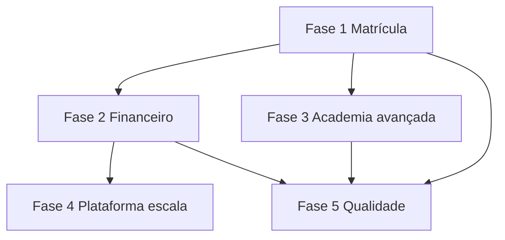

# Plano de atualizações pós-MVP — RingPro

**Versão:** 1.5  
**Data:** 02/09/2026  
**Objetivo:** implementar melhorias **uma por uma**, após o [`PLANO-EXECUCAO.md`](./PLANO-EXECUCAO.md) (RP-001 … RP-105), mantendo arquitetura, RLS e organização do monorepo.

**Relacionado:** [`PRD.md`](./PRD.md) · [`architecture.md`](../.agents/docs/architecture.md) · [`AGENTS.md`](../AGENTS.md)

---

## Como usar (humano)

```text
Execute o PLANO-ATUALIZACOES.md do passo UP-XXX em diante, modo autônomo.
Marque [x] cada passo. Um passo = um escopo (1 migration + 1 feature slice).
Não commitar/PR até eu pedir.
```

**Pré-requisito:** MVP aplicado no Supabase (`db push`, seed, deploy das Edge Functions do README).

---

## Regras de arquitetura (obrigatórias em todo passo)

| Camada | Onde | Regra |
|--------|------|--------|
| Banco | `supabase/migrations/` | 1 passo = 1 migration numerada (`YYYYMMDDHHMMSS_descricao.sql`) |
| RLS | Mesma migration | Toda tabela nova com `ENABLE RLS` + policies; ASSISTANT sem financeiro |
| Edge Functions | `supabase/functions/{nome}/index.ts` | Service role só aqui; validar JWT ou token do passo |
| Tipos | `frontend/src/lib/*-types.ts` | Tipos de domínio compartilhados, sem duplicar por portal |
| API | `frontend/src/features/{portal}/*-api.ts` | Chamadas Supabase/Functions; **sem** lógica de negócio pesada |
| UI | `frontend/src/features/{portal}/*Page.tsx` | Páginas finas; hooks em `hooks/` se reutilizável |
| Rotas | `App.tsx` + `routes/nav-config.tsx` | 1 rota por tela; guards existentes (`ProtectedRoute`, `RoleRoute`) |
| Convites | `frontend/src/features/invite/` | Fluxos públicos `/convite/:token` |
| Notificações | `hooks/useNotifications.ts` | In-app; e-mail via Edge Function |

**Ordem técnica por passo (skill `implement`):**

```text
migration → RLS → Edge Function (se sensível) → *-api.ts → página → nav/rota → seed opcional → build/test
```

**Nomenclatura de IDs:** `UP-1XX` = Fase 1 (matrícula), `UP-2XX` = financeiro, `UP-3XX` = academia avançada, `UP-4XX` = plataforma/escala, `UP-5XX` = qualidade.

---

## Progresso geral

| Fase | Passos | Foco | Status |
|------|--------|------|--------|
| **1** — Matrícula & experiência | UP-101 … UP-113 | Convite, onboarding, agenda | ✅ UP-112 checkpoint |
| **2** — Financeiro real | UP-200 … UP-210 | **Pagar.me** (ADR-001), lembretes, relatórios | ✅ UP-210 checkpoint |
| **3** — Academia avançada | UP-301 … UP-315 | QR, físico, graduação, contrato | ✅ UP-310 checkpoint |
| **4** — Plataforma & escala | UP-401 … UP-410 | Onboarding academia, métricas, filiais | ✅ |
| **5** — Qualidade & produto | UP-501 … UP-510 | E2E, mockups, app, docs ops | ✅ |

### Schema remoto — higiene (02/09/2026) ✅

| Item | Status |
|------|--------|
| DROP legado POS | ✅ |
| Enum `PLATFORM_SUPPORT` / `PLATFORM_FINANCE` | ✅ |
| `platform_staff_invites`, `academy_branches`, RPCs Fase 4 | ✅ |
| Migrations `146000`–`160000` registradas | ✅ |
| **44 tabelas** `public` — só RingPro | ✅ (UP-301…306) |

### Schema hardening — Ondas A e B (02/09/2026) ✅

Ver [`PLANO-SCHEMA-HARDENING.md`](./PLANO-SCHEMA-HARDENING.md).

| Onda | Migrations | Status |
|------|------------|--------|
| **A** | `161000`–`164000` (enums, gateway, RLS plataforma, comments) | ✅ remoto |
| **B** | `171000`–`174000` (`platform_settings`, billing academia, `saas_payments`, `students.branch_id`) | ✅ remoto |

### Portal Professor — auditoria ([`auditoria-portal-professor.md`](./auditoria-portal-professor.md))

Tickets UP-317 … UP-324, UP-303, UP-304, UP-099, UP-320, UP-316: **código concluído** (02/09/2026).

| Status | Itens |
|--------|--------|
| ✅ Código | UP-317, 318, 319, 320, 321, 322, 323, 324, 303, 304, 099, 316 (doc) |
| ✅ Remoto | Migrations professor + Fase 4 aplicadas (02/09/2026) — ver § Schema remoto |
| ⬜ Humano | Roteiro §9.1–9.6 da auditoria |

### Fase 2 — entregas recentes (02/09/2026)

| Ticket | Escopo | Arquivos / rotas principais |
|--------|--------|-----------------------------|
| UP-205 ✅ | Cobrança recorrente cartão + retry D+1/D+3/D+7 | `charge-recurring-invoices`, `20260831890000_recurring_card_billing.sql` |
| UP-207 ✅ | Relatório financeiro academia | `/academy/financeiro/relatorio`, `finance-report.ts` |
| UP-208 ✅ | Relatório financeiro plataforma (MRR, churn) | `/platform/financeiro`, `20260831920000_platform_finance_stats.sql` |
| UP-209 ✅ | Portal aluno: QR PIX + boleto | `PaymentChargePanel`, `charge-display.ts`, `/student/pagamento`, onboarding |
| UP-210 ✅ | Checkpoint pagamentos | `smoke-phase2-checkpoint.mjs`, `test-pagarme-webhook.mjs`, ADR-001 rev.3 |
| UP-206 ⏸️ | E-mail lembrete fatura | Adiado — manter UP-111 in-app + WhatsApp manual |

**Componentes reutilizáveis (pagamentos):** `frontend/src/lib/payments/`, `PaymentChargePanel`, `scripts/smoke/payments.mjs`.

### Fase 1 — checkpoint (02/09/2026)

| Ticket | Escopo | Arquivos principais |
|--------|--------|---------------------|
| UP-112 ✅ | Matrícula ponta a ponta | `smoke-phase1-checkpoint.mjs`, `scripts/smoke/enrollment.mjs` |

Fluxo validado: lead → convite → wizard → plano → modalidade → pagamento mock.

### Fase 3 — entregas recentes (02/09/2026)

| Ticket | Feature flag | Rotas principais |
|--------|--------------|------------------|
| UP-311 ✅ | `module_student_documents` | `/academy/alunos/:id` → aba Documentos |
| UP-312 ✅ | `module_class_makeup` | Chamada + aba Reposições no aluno |
| UP-313 ✅ | `module_class_groups` | `/academy/turmas`, `/student/turmas` |
| UP-302 ✅ | `module_graduation` | `/academy/graduacao`, aba Graduação no aluno |
| UP-305 ✅ | `module_physical_assessment` | Config intervalo + lembretes peso/altura |
| UP-306 ✅ | — | Config → contrato PDF + link no convite |

Migrations: `20260831810000` … `20260831840000`. Todas aplicadas no remoto.

---

# FASE 1 — Matrícula & experiência do aluno

> **Pacote recomendado primeiro.** Depende do convite (`/convite/:token`) já implementado.

## UP-101 — E-mail automático ao gerar convite

- [x] Edge Function `send-student-invite-email` (Resend; stub em dev se sem API key)
- [x] Integrar em `create-student-invite` (envio automático após criar token)
- [x] Template: nome academia, link `/convite/{token}`, validade 7 dias
- [x] Env: `RESEND_API_KEY`, `RESEND_FROM_EMAIL`, `APP_PUBLIC_URL` documentado no README

**Arquivos:** `supabase/functions/_shared/invite-email.ts`, `send-student-invite-email/`, `create-student-invite/`, `features/invite/invite-api.ts`, `NewStudentPage.tsx`, `AcademyLeadsPage.tsx`  
**Done quando:** owner gera convite → e-mail enviado (ou log em dev).

---

## UP-102 — Botão “Enviar por WhatsApp”

- [x] Helper `buildWhatsAppInviteUrl(phone, message)` em `lib/invite-utils.ts`
- [x] Botão ao lado de “Copiar link” (novo aluno + leads)
- [x] Mensagem padrão PT-BR com link de matrícula

**Arquivos:** `lib/invite-utils.ts`, `NewStudentPage.tsx`, `AcademyLeadsPage.tsx`  
**Done quando:** abre `wa.me` com texto pré-preenchido (sem API Business).

---

## UP-103 — Wizard onboarding aluno (pós-login)

- [x] Componente `StudentOnboardingWizard` — passos: perfil → plano → modalidades → pagamento
- [x] Flag em `students`: `onboarding_completed_at`
- [x] Redirect `/student/dashboard` → wizard se incompleto
- [x] Barra de progresso mobile-first

**Arquivos:** migration `20260831190000_student_onboarding.sql`, `features/student/StudentOnboardingWizard.tsx`, `StudentContext`, `App.tsx`, `StudentOnboardingGuard.tsx`  
**Done quando:** aluno novo completa fluxo guiado sem se perder.

---

## UP-104 — Tela detalhe do aluno (academia)

- [x] Rota `/academy/alunos/:studentId`
- [x] Abas ou seções: dados, físico, plano, modalidades, faturas, presença resumo
- [x] Edição inline (owner/professor); assistant só leitura dados não financeiros
- [x] Link da lista de alunos

**Arquivos:** `features/academy/StudentDetailPage.tsx`, `academy-api.ts`, `App.tsx`, `StudentsListPage.tsx`  
**Done quando:** clicar aluno na lista abre detalhe completo.

---

## UP-105 — Histórico peso/altura (evolução física)

- [x] Migration `student_body_metrics` (student_id, measured_at, weight_kg, height_cm, notes)
- [x] RLS: staff da academia + aluno próprio (SELECT); staff e aluno INSERT
- [x] Gráfico simples (SVG + tabela) no detalhe aluno e perfil aluno
- [x] Ao salvar perfil, append automático quando peso/altura mudam

**Arquivos:** migration `20260831200000_student_body_metrics.sql`, `lib/body-metrics-*`, `BodyMetricsChart.tsx`, `StudentDetailPage`, `StudentProfilePage`, `student-api.ts`, `academy-api.ts`  
**Done quando:** segunda medição mostra evolução.

---

## UP-106 — Convite de professor/assistant (link)

- [x] Migration `staff_invites` (espelho de `student_invites`, roles PROFESSOR | ASSISTANT)
- [x] Functions `create-staff-invite`, `complete-staff-invite`
- [x] Rota pública `/convite-equipe/:token`
- [x] UI: `/academy/professores` → “Convidar equipe” (somente SCHOOL_OWNER)

**Arquivos:** `20260831210000_staff_invites.sql`, `features/invite/staff-invite-api.ts`, `StaffInvitePage.tsx`, `ProfessorsPage.tsx`  
**Done quando:** owner convida professor; professor completa cadastro e entra no portal academia.

---

## UP-107 — Termo / regulamento no convite aluno

- [x] Migration `academy_terms` (academy_id, version, content_html, active)
- [x] Checkbox obrigatório no `StudentInvitePage`
- [x] Tabela `student_term_acceptances` (student_id, term_id, accepted_at, ip)
- [x] RLS + Edge Function registra aceite em `complete-student-invite`

**Arquivos:** `supabase/migrations/20260831230000_academy_terms.sql`, `complete-student-invite/`, `features/invite/invite-api.ts`, `StudentInvitePage.tsx`  
**Done quando:** matrícula sem aceite do termo é rejeitada.

---

## UP-108 — Pré-preenchimento do convite a partir do lead

- [x] Coluna `prefill_name` em `student_invites` (ou jsonb `prefill`)
- [x] `create-student-invite` recebe nome do lead
- [x] Formulário convite exibe nome sugerido editável

**Arquivos:** `supabase/migrations/20260831240000_student_invite_prefill.sql`, `create-student-invite/`, `invite-api.ts`, `StudentInvitePage.tsx`, `AcademyLeadsPage.tsx`, `NewStudentPage.tsx`  
**Done quando:** lead “João” → convite já sugere “João”.

---

## UP-109 — Reenviar / cancelar convite pendente

- [x] Status `CANCELLED`; listagem convites pendentes em `/academy/alunos/convites`
- [x] Ações: reenviar (novo token ou mesmo), cancelar
- [x] API `features/invite/invite-api.ts` estendida

**Arquivos:** `resend-student-invite/`, `StudentInvitesPage.tsx`, `invite-api.ts`, `StudentsListPage.tsx`, `App.tsx`  
**Done quando:** owner vê convites abertos e gerencia.

---

## UP-110 — Dashboard academia: gráficos básicos

- [x] RPC ou queries: alunos ativos por mês, inadimplência %, receita 6 meses
- [x] Componente `AcademyCharts.tsx` (recharts ou CSS bars)
- [x] Variante assistant sem gráficos financeiros

**Arquivos:** `supabase/migrations/20260831250000_academy_dashboard_charts.sql`, `AcademyCharts.tsx`, `AcademyDashboardPage.tsx`, `academy-api.ts`  
**Done quando:** owner vê tendência visual.

---

## UP-111 — Lembrete in-app vencimento (aluno)

- [x] Job/cron chama `apply_academy_dunning` + insere `notifications` para aluno (D-3, D+0)
- [x] Edge Function `notify-upcoming-invoices` (cron manual em dev)
- [x] Aluno vê no sino
- [x] Botão manual **Lembrar via WhatsApp** no financeiro da academia (sem automação WhatsApp no MVP)

**Arquivos:** `20260831260000_invoice_reminder_notifications.sql`, `notify-upcoming-invoices/`, `AcademyFinancePage.tsx`, `invite-utils.ts`  
**Done quando:** fatura a vencer em 3 dias gera notificação in-app; staff envia WhatsApp manualmente pelo botão.

---

## UP-112 — Checkpoint Fase 1

- [x] Checklist em `DEV-SEED.md` atualizado
- [x] `npm run build` + `npm run test` verdes
- [x] Fluxo: lead → convite e-mail/WhatsApp → aluno completa → wizard → plano
- [x] Smoke `scripts/smoke-phase1-checkpoint.mjs` + helpers `scripts/smoke/enrollment.mjs`
- [x] `npm run test:smoke:phase1`
- [x] `complete-student-invite` e `public-student-register` com `verify_jwt = false` em `config.toml`

**Arquivos:** `smoke-phase1-checkpoint.mjs`, `smoke/enrollment.mjs`, `smoke/lib.mjs`  
**Comando:** `cd frontend && npm run test:smoke:phase1`  
**Done quando:** smoke passa com lead convertido, aluno ATIVO e onboarding concluído (dados smoke removidos se houver service role).

---

## UP-113 — Agenda de aulas (grupo, individual, eventos)

- [x] Migration `class_sessions` + `schedule_series` + RLS
- [x] Tipos: turma (grupo), aula individual (só o aluno), evento (sparring, campeonato, etc.)
- [x] Cor de fundo por bloco + presets por tipo de evento
- [x] Repetição semanal (vários dias até data fim)
- [x] `/academy/agenda` — professor, sub-professor e owner criam/cancelam
- [x] `/student/agenda` — aluno vê só o que é dele (RPC `get_student_class_sessions`)
- [x] Feature flag `module_class_schedule`

**Visibilidade:**
- **Grupo** → alunos matriculados na modalidade
- **Individual** → apenas o aluno escolhido
- **Evento** → toda academia ou modalidade específica

**Fora deste slice (futuro):** vista mensal, arrastar blocos, notificação push de aula, link direto com presença.

**Done quando:** professor agenda aula individual e só aquele aluno vê; turma aparece para modalidade; repetição semanal funciona.

---

# FASE 2 — Financeiro real (Pagar.me)

> **Decisão de produto:** gateway padrão = **Pagar.me**. Ver [`decisoes/001-gateway-pagamentos.md`](./decisoes/001-gateway-pagamentos.md) (ADR-001, revisão 02/09/2026).  
> **Dev:** sem `PAGARME_API_KEY` → manter `MockPaymentService` + `simulate-payment` (comportamento atual).

## UP-200 — Avaliar e escolher gateway ✅

- [x] Comparar candidatos do ADR-001
- [x] Critérios: sandbox, PIX + cartão tokenizado, webhooks, docs API
- [x] Registrar escolha: **Pagar.me** em `decisoes/001-gateway-pagamentos.md`
- [x] Documentar env vars no ADR-001 (secrets no Supabase, não no repo)

**Done:** Pagar.me definido — desbloqueia UP-203/UP-204.

---

## UP-201 — Camada `lib/payments/` (abstração)

- [x] `PaymentService` interface: tokenizeCard, createPix, createBoleto, parseWebhook
- [x] `MockPaymentService` (dev) + `PagarmePaymentService` (prod)
- [x] Factory por env `VITE_PAYMENTS_MODE=mock|live`
- [x] Edge: `supabase/functions/_shared/payments/` (mesma abstração server-side)

**Done quando:** UI depende da interface, não do SDK direto.

---

## UP-202 — Migration: campos gateway em faturas/pagamentos

- [x] `academy_invoices` / `academy_payments` / `saas_invoices`: colunas gateway — **Onda A** (`20260831620000_schema_gateway.sql`)
- [x] Índices webhook / idempotency
- [x] Edge Function `create-payment-charge` persiste `gateway_provider`, `gateway_charge_id`, `gateway_metadata`

---

## UP-203 — Edge Function: criar cobrança (PIX/cartão)

- [x] Substituir stub `create-payment-charge` por API Pagar.me (fallback mock sem `PAGARME_API_KEY`)
- [x] Reutilizar cobrança existente via `gateway_metadata` na fatura
- [x] Tokenização cartão no portal aluno via `PagarmePaymentService` + `VITE_PAGARME_PUBLIC_KEY`
- [x] Manter `pagarme-webhook` como handler oficial (UP-204)

---

## UP-204 — Webhook gateway produção

- [x] Edge Function `pagarme-webhook`: validar assinatura HMAC, idempotência, atualizar invoice + student ATIVO
- [x] Log em `audit_logs` (`INVOICE_PAID_WEBHOOK`)
- [x] Documentar URL no README e `verify_jwt = false` em `config.toml`

---

## UP-205 — Cartão recorrente (assinatura aluno)

- [x] Vincular `student_payment_methods` ao ciclo de cobrança (`list_recurring_card_charge_jobs`)
- [x] Cron `charge-recurring-invoices` (Edge Function + doc pg_cron no README)
- [x] Retry D+1, D+3, D+7 conforme PRD WF-6 (`record_recurring_card_charge_failure`)

---

## UP-206 — E-mail lembrete de vencimento (financeiro) ⏸️ adiado

> **Decisão (02/09/2026):** manter apenas lembretes **in-app** (UP-111) + WhatsApp manual no financeiro. E-mail automático (Resend) pode gerar custo em produção — reavaliar quando houver volume/need.

- [ ] ~~Template e-mail D-3, D+1 atraso (owner + aluno)~~ — adiado
- [ ] ~~Function `send-invoice-reminder`~~ — adiado
- [x] Flag `module_notifications_email` já existe (convites; não usada para lembrete de fatura)

**Coberto por UP-111:** `notify-upcoming-invoices` + sino do aluno (D-3, vencimento/atraso).

---

## UP-207 — Relatório financeiro academia (PDF/CSV avançado)

- [x] Página `/academy/financeiro/relatorio`
- [x] Filtro por período, status, categoria
- [x] Export CSV (`finance-report.ts`) + impressão/PDF via navegador

---

## UP-208 — Relatório financeiro plataforma (MRR, churn academias)

- [x] KPIs reais em `fetchPlatformKpis` / `platform_network_stats` (total alunos rede, churn 30d, receita mês)
- [x] Export CSV enriquecido (`platform-finance-report.ts`) + filtros no `/platform/financeiro`

---

## UP-209 — Portal aluno: boleto PDF / QR PIX real

- [x] Tela pagamento consome `create-payment-charge` live
- [x] Exibir QR imagem + copia-cola
- [x] `PaymentChargePanel` — QR (URL Pagar.me ou gerado via `qrcode`) + copiar código
- [x] Boleto: linha digitável + link PDF quando retornado pelo gateway (`boletoUrl`)
- [x] `/student/pagamento` e onboarding passo Pagamento
- [x] Feature flags `module_payments_pix` / `module_payments_boleto` na página de pagamento

**Arquivos:** `PaymentChargePanel.tsx`, `charge-display.ts`, `charge-display.test.ts`, `PaymentPage.tsx`, `StudentOnboardingWizard.tsx`, `pagarme-payment-service.ts` (edge `boletoUrl`)  
**Done quando:** aluno gera PIX → vê QR + copia-cola; boleto exibe linha digitável e link PDF (live).

---

## UP-210 — Checkpoint Fase 2

- [x] Pagamento sandbox do gateway escolhido ponta a ponta
- [x] Webhook testado (CLI do provedor ou mock assinado)
- [x] ADR-001 atualizado com env vars e link do dashboard
- [x] Smoke `scripts/smoke-phase2-checkpoint.mjs` + `scripts/test-pagarme-webhook.mjs`
- [x] Helpers reutilizáveis `scripts/smoke/payments.mjs`
- [x] `npm run test:smoke:phase2`

**Arquivos:** `smoke-phase2-checkpoint.mjs`, `test-pagarme-webhook.mjs`, `smoke/payments.mjs`, [`001-gateway-pagamentos.md`](./decisoes/001-gateway-pagamentos.md)  
**Comando:** `cd frontend && npm run test:smoke:phase2`  
**Done quando:** PIX + boleto via `create-payment-charge`; webhook ou `simulate-payment` confirma fatura PAGO e aluno ATIVO.

---

# FASE 3 — Academia avançada (diferencial luta)

## UP-301 — Check-in QR code ✅

- [x] Migration `attendance_qr_sessions` (modalidade, data, turma opcional, token rotativo, expiração)
- [x] RPCs `create_attendance_qr_session` e `redeem_attendance_qr_checkin`
- [x] Tela staff `/academy/presenca/qr` — gera QR + link copiável
- [x] Aluno escaneia/abre `/student/check-in/:token` — confirma presença
- [x] Feature flag `module_attendance` (mesma da chamada)
- [x] RLS: staff gerencia sessões; aluno só faz check-in próprio via RPC

**Arquivos:** `20260831840000_attendance_qr_sessions.sql`, `AttendanceQrPage.tsx`, `StudentQrCheckInPage.tsx`, `attendance-qr-api.ts`  
**Done quando:** professor gera QR → aluno escaneia → presença registrada em `attendance_records`.

---

## UP-302 — Graduação / faixas (MVP simples) ✅

- [x] Migration `belt_levels`, `student_belt_history`
- [x] RPC `promote_student_belt` + notificação in-app ao aluno
- [x] CRUD faixas por modalidade em `/academy/graduacao` (botão “Faixas padrão”)
- [x] Registro promoção no detalhe aluno — aba **Graduação**
- [x] Portal aluno: `/student/graduacao` (faixa atual + histórico)
- [x] Feature flag `module_graduation` (default off)
- [x] RLS: owner/assistant/professor no escopo da modalidade; aluno lê o próprio histórico

**Arquivos:** `20260831850000_belt_graduation.sql`, `GraduationLevelsPage.tsx`, `StudentGraduationSection.tsx`, `graduation-api.ts`  
**Done quando:** dono configura faixas da modalidade Boxe → professor registra promoção no aluno → aluno vê faixa em `/student/graduacao`.  
**Ativar:** Portal Plataforma → Feature flags → **Graduação / faixas**.

---

## UP-303 — Período experimental (ex-trial)

- [x] Config pelo dono: desligado | por dias | aula grátis | manual (`AcademySettingsPage`)
- [x] Migration `students.trial_ends_at` + `academies.settings` (`trial_mode`, `trial_days`)
- [x] Edge `complete-student-invite` / `create-student` respeitam config (`trial-policy.ts`)
- [x] `NewStudentForm`: escolha manual quando `trial_mode === MANUAL`
- [x] UI: label amigável **Experimental** (UP-318)
- [ ] Aplicar migration no remoto — ✅ 02/09/2026
- [ ] Teste manual §9.4 da auditoria
- [ ] Cron converte para INADIMPLENTE ou ATIVO após pagamento (futuro)

**Docs:** [`auditoria-portal-professor.md`](./auditoria-portal-professor.md) · PRD §8.3.1

---

## UP-316 — Escopo professor em KPIs e aniversários

- [x] **Verificado:** RLS em `students`/`attendance_records` escopa `fetchAcademyKpis`; RPC `get_academy_dashboard_charts` já usa `v_scoped_professor`
- [x] Teste manual documentado — [`auditoria-portal-professor.md` §9.2](./auditoria-portal-professor.md#92-up-316--validação-kpis-e-gráficos-professor-vs-owner)
- [ ] *(Opcional)* RPC única `get_academy_dashboard_kpis` — só se quiser reduzir round-trips
- [ ] Executar validação humana no ambiente remoto

**Checklist:** [`auditoria-portal-professor.md`](./auditoria-portal-professor.md) §5.1 · §9.2

---

## UP-321 — Escopo aluno sem modalidade (opção A)

- [x] Migration `20260831400000_student_scope_requires_category.sql`
- [x] `student_in_instructor_scope` exige modalidade compartilhada
- [x] `professor_can_manage_student_categories` + policies `stu_cat_*`
- [x] `NewStudentForm`: professor obrigado a escolher modalidade no cadastro
- [ ] Aplicar migration no remoto — ✅ 02/09/2026
- [ ] Teste manual §9.3 da [`auditoria-portal-professor.md`](./auditoria-portal-professor.md)

---

## UP-322 — Esconder link de matrícula para professor

- [x] `NewStudentForm`: seção convite só se `canManageAcademy` *(implementado em 2026-08)*
- [x] **Revertido (PRD v1.5):** professor e assistant voltam a gerar link via `canCreateStudentInvite`; RLS `invites_staff` em `20260831440000_student_invites_staff.sql`
- [ ] Teste manual §9.1 item 5 da auditoria (atualizar cenário: professor **deve** ver link)

---

## UP-323 — Empty state alunos (professor)

- [x] `StudentsListPage`: mensagem quando `isScopedProfessor` e lista vazia

---

## UP-324 — UX aluno fora do escopo

- [x] `StudentDetailPage`: `FeedbackMessage` warning quando aluno não carrega

---

## UP-317 — FeedbackMessage em todo portal Academia

- [x] Dashboard, alunos lista, categorias, novo aluno, edit modal, detalhe aluno
- [x] Páginas owner: financeiro, leads, professores, planos
- [x] Modais e sidebar: inativar aluno, plano da aula, dashboard sidebar

---

## UP-318 — Labels de status aluno (i18n)

- [x] Helper `formatStudentStatus()` + `student-status.ts` + testes
- [x] Badges e selects nas telas academy/student principais

---

## UP-319 — Presença: alunos experimental na chamada

- [x] `fetchStudentsForAttendance` + `AttendancePage`
- [x] Alinhado com UP-303 (status experimental na chamada)

---

## UP-320 — Mockup dashboard professor

- [x] `mockups/academy/00-Dashboard-Professor.html` — sem KPI receita, escopo turmas

---

## UP-099 — Notificações in-app (portal academia)

- [x] `AcademyNotificationsPage` lista notificações via `useNotifications`
- [x] Marcar lida / marcar todas (mesma API do sino no topbar)
- [ ] Teste manual §9.1 item 12 da auditoria

---

## UP-304 — Relatório presença professor

- [x] `/academy/relatorios/presenca` — faltas consecutivas, % por turma
- [x] Filtros: período, turma, mínimo de faltas seguidas
- [x] ASSISTANT e professor veem (RLS `attendance_*`); sem financeiro
- [x] Menu + atalho no dashboard quando `module_attendance` ativo
- [x] Testes `attendance-report.test.ts`
- [ ] Teste manual §9.5 da [`auditoria-portal-professor.md`](./auditoria-portal-professor.md)

**Arquivos:** `lib/attendance-report.ts` · `AttendanceReportPage.tsx` · `academy-api.ts` (`fetchAttendanceReportRecords`)

---

## UP-305 — Avaliação física periódica (agendada) ✅

- [x] Migration `body_assessment_cycles` + RPC `notify_physical_assessment_due`
- [x] Config intervalo (meses) em Configurações da academia
- [x] Lembrete in-app aluno + staff (owner, assistant, professor no escopo)
- [x] Edge Function `notify-physical-assessment-due` (cron manual em dev)
- [x] Banner pendência no perfil aluno e aba Físico do detalhe
- [x] Feature flag `module_physical_assessment` (default off)
- [x] Ciclo resolvido automaticamente ao registrar nova medição

**Arquivos:** `20260831860000_physical_assessment_reminders.sql`, `notify-physical-assessment-due/`, `PhysicalAssessmentBanner.tsx`, `body-assessment-api.ts`  
**Done quando:** flag ON + intervalo 6 meses → aluno sem medição recente recebe notificação → staff vê alerta → aluno atualiza peso/altura → ciclo fecha.  
**Ativar:** Portal Plataforma → Feature flags → **Avaliação física periódica**.

---

## UP-306 — Contrato PDF armazenado ✅

- [x] Bucket Storage `academy-documents/{academy_id}/` (PDF, privado)
- [x] Tabela `academy_contract_documents` (um ativo por academia)
- [x] Upload/substituição em **Configurações** (somente dono)
- [x] Link no convite `/convite/:token` — abre PDF via Edge Function com token válido
- [x] RPC `get_public_student_invite` retorna metadados do contrato ativo

**Arquivos:** `20260831870000_academy_contract_pdf.sql`, `AcademyContractSection.tsx`, `public-invite-contract-url/`  
**Done quando:** dono envia PDF em Configurações → aluno no convite vê botão **Abrir contrato (PDF)**.

---

## UP-307 — Filtro avançado alunos (`FilterDrawer`)

- [x] Componente `FilterDrawer` (padrão UI Limpar/Aplicar)
- [x] Lista alunos: status, plano, categoria, inadimplente

---

## UP-308 — Edição em lote status aluno

- [x] Seleção múltipla na lista; ação “marcar inativo” (owner)

---

## UP-309 — Integração lead → aluno em 1 clique

- [x] “Converter lead” chama `create-student-invite` + marca lead sem passo manual extra

---

## UP-310 — Checkpoint Fase 3 ✅

- [x] Smoke automatizado `scripts/smoke-phase3-checkpoint.mjs` (UP-301 QR + UP-302 graduação)
- [x] Seed dev: flags Fase 3 ON + faixas padrão Boxe (`seed-dev-users.mjs`)
- [x] `npm run test:smoke:phase3` no ambiente seed (23/23 checks)
- [x] Fix migration `20260831880000` — `gen_random_bytes` via `search_path` extensions (QR no Supabase remoto)
- [x] Checklist manual Fase 3 em `DEV-SEED.md` (UP-301…306)

**Comando:** `cd frontend && npm run test:smoke:phase3`  
**Done quando:** QR gera presença + promoção de faixa aparece no histórico do aluno seed.

---

## UP-311 — Importação de documentos do aluno (staff) ✅

> **Cenário:** aluno envia atestado, laudo ou documento de saúde por WhatsApp/e-mail; dono ou professor **anexa no perfil** do aluno no sistema.

- [x] Migration `student_documents` + enum `student_document_type` (`SAUDE`, `ATESTADO`, `CONTRATO`, `OUTRO`)
- [x] Bucket Storage `student-documents` com RLS (`academy_id`/`student_id` no path; staff upload; aluno lê os próprios)
- [x] Colunas: `student_id`, `academy_id`, `document_type`, `title`, `file_path`, `mime_type`, `uploaded_by`, `notes`, `received_via` (`WHATSAPP`, `EMAIL`, `PRESENCIAL`, `OUTRO`)
- [x] UI: aba **Documentos** no detalhe do aluno (`/academy/alunos/:id`) — upload, lista, download, exclusão (owner; professor no escopo da turma)
- [x] ASSISTANT: upload/leitura no escopo da academia; **sem** financeiro (inalterado)
- [x] Feature flag `module_student_documents` (default off até validar)
- [x] Auditoria: `audit_logs` em upload/exclusão

**Arquivos:** `20260831810000_student_documents.sql`, `StudentDocumentsSection.tsx`, `student-documents-api.ts`, `student-document-storage.ts`  
**Done quando:** staff anexa PDF/foto recebida offline; documento aparece no histórico do aluno com tipo e data.  
**Ativar:** Portal Plataforma → Feature flags da academia → **Documentos do aluno**.

---

## UP-312 — Reposição de aula (crédito / remarcação) ✅

> **Cenário:** aluno faltou aula de grupo ou individual e a academia concede **reposição** em outro horário ou turma compatível.

- [x] Migration: `class_makeup_credits` (aluno, modalidade, sessão de origem opcional, validade, status `DISPONIVEL`/`USADO`/`EXPIRADO`/`CANCELADO`)
- [x] Migration: `class_makeup_redemptions` (crédito → sessão de destino `class_sessions`, registrado por staff)
- [x] Regra MVP: 1 crédito = 1 reposição na mesma `training_category` (turma/modalidade); validade configurável em `academies.settings` (`makeup_credit_days`, default 30 dias)
- [x] UI academia: conceder crédito a partir da **chamada** (falta) ou manualmente no detalhe aluno; agendar reposição (sessão `INDIVIDUAL` com `is_makeup`)
- [ ] UI aluno (opcional V2 slice): solicitar reposição → fila pendente para staff aprovar
- [x] Notificação in-app ao aluno quando crédito disponível ou reposição confirmada
- [x] Feature flag `module_class_makeup` (default off até validar)
- [x] Relatório: KPI créditos abertos vs usados no dashboard (owner)

**Arquivos:** `20260831820000_class_makeup.sql`, `StudentMakeupSection.tsx`, `makeup-api.ts`, `AttendancePage.tsx`, `AcademySettingsPage.tsx`  
**Depende de:** UP-113 (agenda) ✅ · `module_attendance` ✅  
**Fora do slice:** integração automática com plano/limite de reposições por mês (V2)  
**Done quando:** staff marca falta → gera crédito → agenda aula de reposição → aluno vê na `/student/agenda`.  
**Ativar:** Portal Plataforma → Feature flags da academia → **Reposição de aula**.

---

## UP-313 — Turmas com roster fixo (além da modalidade) ✅

> **Problema:** hoje **turma = modalidade** (`training_categories`). Toda aula `GROUP` na agenda aparece para **todos** os alunos da modalidade. Academias reais costumam ter **várias turmas na mesma modalidade** (ex.: Boxe Kids manhã vs noite) com listas de alunos diferentes e horários fixos.

### Conceito proposto

| Camada | Entidade | Exemplo |
|--------|----------|---------|
| **Modalidade** (já existe) | `training_categories` | Boxe, Muay Thai |
| **Turma operacional** (novo) | `class_groups` | “Boxe Kids — Seg/Qua 18h” |
| **Roster** (novo) | `class_group_members` | 12 alunos fixos na turma |
| **Aula na agenda** | `class_sessions` | `GROUP` pode apontar para `class_group_id` **ou** só `category_id` (retrocompatível) |

### Escopo técnico

- [x] Migration `class_groups` (modalidade pai, nome, professor, filial, capacidade, `schedule_hint`)
- [x] Migration `class_group_members` + RPCs `add_class_group_member`, `remove_class_group_member`, `import_category_students_to_class_group`
- [x] Alter `class_sessions` / `schedule_series`: coluna opcional `class_group_id`
- [x] Alter `attendance_records`: coluna opcional `class_group_id` + índices únicos parciais
- [x] `get_student_class_sessions` atualizado — sessão com `class_group_id` visível só para membros do roster
- [x] RLS owner / professor / assistant / aluno
- [x] UI academia: `/academy/turmas` + detalhe com roster e importação da modalidade
- [x] UI aluno: `/student/turmas`
- [x] Integração agenda (turma fixa opcional) e presença (filtro por turma)
- [x] Feature flag `module_class_groups` (default **off**)
- [x] Seed dev: 1 modalidade Boxe + 2 turmas (manhã/noite) com alunos distintos

**Arquivos:** `20260831830000_class_groups.sql`, `ClassGroupsPage.tsx`, `ClassGroupDetailPage.tsx`, `class-groups-api.ts`  
**Done quando:** academia com flag on cria “Boxe Kids Manhã”, coloca 8 alunos, agenda aula de grupo só para esses 8; aluno de outra turma da mesma modalidade **não** vê a aula.  
**Ativar:** Portal Plataforma → Feature flags → **Turmas com roster fixo**.

---

## Glossário — “turma” no RingPro (estado atual)

| Termo na UI | No banco | O que é |
|-------------|----------|---------|
| **Modalidade** | `training_categories` | Ex.: Boxe Kids, Feminino, Muay Thai iniciante |
| **Turma operacional** (opcional) | `class_groups` + `class_group_members` | Roster fixo dentro de uma modalidade — flag `module_class_groups` |
| **Aluno na modalidade** | `student_categories` | Vínculo N:N aluno ↔ modalidade |
| **Professor da modalidade** | `instructor_training_categories` | Professor ↔ modalidades que leciona |
| **Aula em grupo** | `class_sessions` (`GROUP`) | Com `class_group_id` → só roster; sem → todos da modalidade |
| **Aula individual** | `class_sessions` (`INDIVIDUAL`) | Ligada a um `student_id` específico |
| **Reposição** | `class_makeup_credits` | Crédito por falta — flag `module_class_makeup` |
| **Check-in QR** | `attendance_qr_sessions` | Token rotativo — mesma flag `module_attendance` |

**Cadastro de aluno:**

- **Professor:** deve escolher **pelo menos uma** modalidade das turmas dele (`NewStudentForm` + UP-321).
- **Dono / assistant:** podem cadastrar sem modalidade no ato; vínculo pode ser feito depois no detalhe do aluno ou no onboarding do aluno.
- **Turma fixa (UP-313):** opcional após vínculo na modalidade; entrada na turma exige modalidade compatível.

**Flags off:** academias simples continuam só com modalidade (`training_categories`) — comportamento legado preservado.

---

# FASE 4 — Plataforma & escala

## UP-401 — Wizard onboarding nova academia

- [x] `/academy/onboarding` pós-primeiro login owner: logo, categorias, plano, publicar landing
- [x] Flag `academy.onboarding_completed` em settings jsonb

---

## UP-402 — Upload logo academia (Storage)

- [x] Bucket RLS `academy-logos` + `landing-assets` (UP-OWN-04)
- [x] Config + landing usam URL pública

---

## UP-403 — Métricas plataforma completas

- [x] RPC `platform_network_stats`
- [x] Dashboard plataforma sem placeholders

---

## UP-404 — Gestão equipe plataforma (PLATFORM_OWNER)

- [x] Convidar suporte/financeiro (`PLATFORM_SUPPORT`, `PLATFORM_FINANCE`)
- [x] Fora do tenant academia — `platform_staff_invites` + roles globais

---

## UP-405 — Multi-unidade (filiais) — fundação

- [x] Migration `academy_branches` (academy_id parent, slug filial)
- [x] RLS: owner vê todas filiais do grupo
- [x] **Escopo mínimo:** cadastro de filiais em `/academy/filiais`

---

## UP-406 — Subdomínio landing V2

- [x] Doc ADR [`002-landing-subdomain.md`](./decisoes/002-landing-subdomain.md) + helper `landing-url.ts`

---

## UP-407 — Feature flag `module_student_self_register`

- [x] Landing com cadastro público opcional (além do convite)
- [x] Edge `public-student-register`; desligado por default

---

## UP-410 — Checkpoint Fase 4

- [x] UP-401 … UP-407 entregues; migrations `20260831460000` … `20260831490000`
- [x] Schema remoto higienizado — DROP POS + `20260831500000` + scripts SQL Editor (02/09/2026)
- [x] Verificação remota: **44 tabelas** RingPro (02/09/2026), 0 legado POS, RPCs e enum plataforma OK
- [x] Schema hardening Ondas A + B aplicadas (`161000`–`164000`, `171000`–`174000`)

---

# FASE 5 — Qualidade, mockups & produto

## UP-501 — Mockups HTML faltantes (por portal)

- [x] Tokens `_shared/base.css`
- [x] `_shared/components.html`, `_shared/tailwind.config.js`, `_shared/layout.css`
- [x] `auth/*` (00–03)
- [x] `platform/*` (dashboard, academias, financeiro, config, auditoria)
- [x] `academy/*` (owner, assistant, professor, alunos, financeiro, presença, etc.)
- [x] `student/*` (dashboard, plano, modalidades, pagamento, histórico, perfil)
- [x] `landing/*` (template público + editor)

---

## UP-502 — Testes E2E Playwright

- [x] Fluxo: owner → convite → aluno → pagamento mock → ativo
- [x] `frontend/e2e/enrollment-payment.spec.ts` + `playwright.config.ts`
- [x] `npm run test:e2e` (sobe Vite automaticamente)
- [x] CI opcional GitHub Actions (`.github/workflows/e2e.yml`, `workflow_dispatch`)

---

## UP-503 — Testes RLS (script SQL ou Vitest + Supabase local)

- [x] ASSISTANT denied financeiro
- [x] PROFESSOR denied financeiro (read + INSERT/RPC)
- [x] Tenant isolation (academy_id estrangeiro → zero linhas)
- [x] Smoke `scripts/smoke-rls-checkpoint.mjs` + helpers `scripts/smoke/rls.mjs`
- [x] `npm run test:smoke:rls`

**Comando:** `cd frontend && npm run test:smoke:rls`  
**Done quando:** assistant/professor não leem nem gravam financeiro; consultas a outro `academy_id` retornam vazio.

---

## UP-504 — Capacitor shell portal aluno

- [x] `apps/student-app` — empacotar build Vite (`npm run build:capacitor`)
- [x] Deep link `/convite/:token` — `ringpro://convite/:token` + handler `deep-link.ts`
- [x] Snippets Android/iOS + [`apps/student-app/README.md`](../apps/student-app/README.md)

---

## UP-505 — Push notifications (FCM)

- [x] Tabela `push_device_tokens` + RLS
- [x] Edge `register-push-token` (upsert token autenticado)
- [x] `_shared/push/fcm.ts` + `dispatch.ts` (FCM legacy API via `FCM_SERVER_KEY`)
- [x] `notify-upcoming-invoices` — push após lembretes de vencimento
- [x] `create-student-invite` / `resend-student-invite` — push de convite (usuário existente)
- [x] Feature flag `module_notifications_push` (opt-in, default off)
- [x] Frontend: `StudentPushHandler` + `@capacitor/push-notifications`

---

## UP-506 — Documentação operação (runbook)

- [x] `docs/RUNBOOK.md`: backup, rotate keys, dunning cron, Pagar.me

---

## UP-507 — Revisão práticas proibidas (periódica)

- [x] Grep service_role no frontend, `any`, nomenclatura RingPro
- [x] `scripts/check-prohibited-practices.mjs`
- [x] `npm run check:practices`

---

## UP-510 — Release notes template

- [x] `docs/RELEASE.md` por fase concluída + template para próximas releases

---

# Dependências entre fases



**Ordem sugerida de execução:** Fase 1 completa → Fase 2 → Fase 3 em paralelo parcial com Fase 2 → Fase 4 → Fase 5 contínua.

---

# Mapa rápido: sugestão → passo

| Sugestão anterior | Passo(s) |
|-------------------|----------|
| E-mail no convite | UP-101 |
| WhatsApp no convite | UP-102 |
| Onboarding guiado aluno | UP-103 |
| Detalhe do aluno | UP-104 |
| Histórico peso/altura | UP-105 |
| Convite professor | UP-106 |
| Termo digital | UP-107 |
| Gateway pagamento (Pagar.me) | UP-200 … UP-210 · [ADR-001](./decisoes/001-gateway-pagamentos.md) |
| Lembretes vencimento | UP-111, UP-206 |
| Gráficos dashboard | UP-110, UP-208 |
| QR check-in | UP-301 ✅ |
| Contrato PDF matrícula | UP-306 ✅ |
| Trial 7 dias | UP-303 |
| Documentos do aluno (upload staff) | UP-311 ✅ |
| Reposição de aula | UP-312 ✅ |
| Turmas com roster fixo (class_groups) | UP-313 ✅ |
| Mockups HTML | UP-501 |
| E2E | UP-502 |
| App Capacitor | UP-504 |

---

# Comandos por passo (validação mínima)

```bash
# Após migration
npx supabase db push

# Após Edge Function nova ou alteração em config.toml (verify_jwt)
supabase functions deploy <nome>

# Frontend — unitários + build
cd frontend && npm run typecheck && npm run test && npm run build

# Smoke checkpoints por fase (API, sem browser)
cd frontend && npm run test:smoke:phase1   # UP-112 matrícula
cd frontend && npm run test:smoke:phase2   # UP-210 pagamentos
cd frontend && npm run test:smoke:phase3   # UP-310 QR + graduação
cd frontend && npm run test:smoke          # portal academia (auditoria professor)
cd frontend && npm run test:smoke:rls      # UP-503 RLS financeiro + tenant
cd frontend && npm run test:e2e           # UP-502 E2E Playwright (browser)
cd frontend && npm run check:practices    # UP-507 práticas proibidas
cd apps/student-app && npm run sync       # UP-504 Capacitor (após add:android/ios)
```

Helpers compartilhados: `scripts/smoke/lib.mjs`, `enrollment.mjs`, `payments.mjs`.

---

# Governança

- Cada **UP-XXX** = idealmente **1 branch / 1 PR** quando for commitar.
- Atualizar este arquivo marcando `[x]` ao concluir.
- Se o passo alterar requisitos de produto, atualizar [`PRD.md`](./PRD.md) (versão + data).
- Novos passos: continuar numeração (`UP-113`, `UP-211`, …) — não reordenar IDs existentes.
- Decisões de produto/arquitetura: registrar em [`docs/decisoes/`](./decisoes/).

---

**Fim do plano de atualizações.** Fases 1–4 concluídas (checkpoints UP-112, UP-210, UP-310, UP-410). Próximo bloco: **Fase 5** (UP-501 … UP-510).
