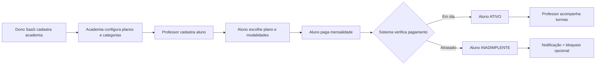
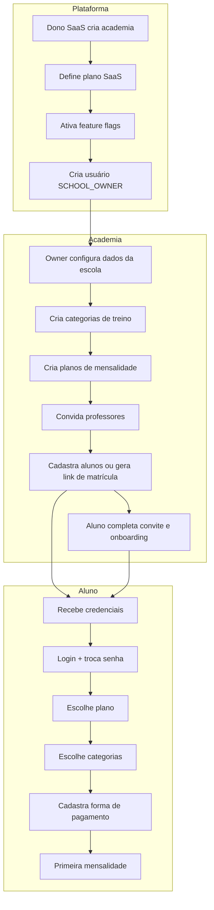

# PRD — RingPro (MVP)

**Versão:** 1.10  
**Data:** 03/09/2026  
**Status:** Fonte única e vigente de requisitos do produto.  
**Produto:** RingPro — plataforma SaaS multi-tenant para gestão de academias de artes marciais (boxe, Muay Thai, Jiu-Jitsu, MMA, etc.)

**Nome oficial:** RingPro.

**Regra de precedência:** este PRD é a única fonte de verdade para requisitos, regras de negócio, escopo, fluxos e prioridades.

**Escopo deste PRD:** requisitos de produto e decisões consolidadas do MVP. Instruções operacionais de agentes ficam fora deste documento, em `.agents/skills/`.

**Referências de metodologia:** [padrões/](../padrões/) — Playbook, Práticas Proibidas, Padrões UI.

---

## Sumário

1. [Visão e problema](#1-visão-e-problema)
2. [Objetivos e métricas de sucesso](#2-objetivos-e-métricas-de-sucesso)
3. [Personas e portais](#3-personas-e-portais)
4. [Loop principal do produto](#4-loop-principal-do-produto)
5. [Escopo MVP vs fora de escopo](#5-escopo-mvp-vs-fora-de-escopo)
   - [5.3 Estratégia multi-canal — web e apps nas lojas](#53-estratégia-multi-canal--web-e-apps-nas-lojas)
6. [Roadmap de entregas (ordem de implementação)](#6-roadmap-de-entregas-ordem-de-implementação)
7. [Épicos e histórias (mapa)](#7-épicos-e-histórias-mapa)
8. [Requisitos funcionais por portal](#8-requisitos-funcionais-por-portal)
9. [Landing page por academia](#9-landing-page-por-academia)
10. [Regras de negócio fechadas](#10-regras-de-negócio-fechadas)
11. [Permissões e RBAC](#11-permissões-e-rbac)
12. [Feature flags (módulos ativáveis)](#12-feature-flags-módulos-ativáveis)
13. [Modelo de dados (resumo)](#13-modelo-de-dados-resumo)
14. [Integrações e dependências externas](#14-integrações-e-dependências-externas)
15. [Requisitos não funcionais](#15-requisitos-não-funcionais)
16. [Design system e padrões de UX](#16-design-system-e-padrões-de-ux)
17. [Documentação viva e rastreabilidade](#17-documentação-viva-e-rastreabilidade)
18. [Itens abertos e roadmap futuro](#18-itens-abertos-e-roadmap-futuro)
19. [Governança deste PRD](#19-governança-deste-prd)

---

## 1. Visão e problema

### 1.1 Visão

Conectar donos de academias de artes marciais, professores e alunos em uma plataforma SaaS multi-tenant que centraliza cadastro de alunos, mensalidades, controle de inadimplência, categorias de treino e presença online de cada escola — com landing page própria por academia.

### 1.2 Problema

| Stakeholder | Dor | Solução no produto |
|---|---|---|
| Dono do SaaS | Operar múltiplas academias, cobrar assinatura da plataforma, ver métricas globais | Portal Plataforma: academias, planos SaaS, financeiro global, feature flags |
| Dono da academia | Controlar alunos, mensalidades, professores e inadimplência | Portal Academia: dashboard, alunos, planos locais, financeiro |
| Professor | Gerenciar alunos e turmas **nas modalidades vinculadas**, sem planilha | Portal Academia (escopo pedagógico): alunos, categorias, presença, agenda — **sem financeiro** |
| Sub-professor | Apoiar operação sem acesso financeiro | Portal Academia (perfil restrito): alunos (toda academia), turmas, presença — sem financeiro |
| Aluno | Pagar mensalidade, escolher plano e modalidades | Portal Aluno: planos, pagamento (cartão/PIX), categorias, status |
| Visitante | Conhecer a academia antes de se matricular | Landing page pública por academia (subdomínio ou slug) |

### 1.3 Princípios de produto

- **Backend-first** — rotas e regras de negócio antes das telas; guards são a barreira real de acesso.
- **MVP completo** — todos os fluxos descritos neste PRD devem funcionar de ponta a ponta; não aceitar "telas mortas".
- **Multi-tenant nativo** — cada academia é um tenant isolado; dados nunca vazam entre academias.
- **Feature flags por academia** — módulos opcionais (presença, landing, cartão, etc.) ativáveis/desativáveis.
- **PRD prevalece** — este documento é a referência única para requisitos e decisões.
- **PCI-safe** — cartão tokenizado via gateway; professor/sub-professor nunca coleta dados de cartão.
- **Supabase como plataforma** — banco, auth, storage e RLS multi-tenant via Supabase; ver seção 14.
- **Multi-canal (web + app)** — MVP entrega **web responsiva** na internet; arquitetura **app-ready** para App Store / Google Play na V2 sem refazer backend; ver [§5.3](#53-estratégia-multi-canal--web-e-apps-nas-lojas).
- **Nomenclatura RingPro** — proibido referenciar KTech, Join Club ou Nex/Next Club em qualquer artefato deste repositório; ver [Práticas Proibidas §10](../padrões/03-Praticas-Proibidas.md).
- **Skills obrigatórias** — agentes de IA devem ler [`AGENTS.md`](../AGENTS.md) e a skill `read-standards` antes de qualquer tarefa; skills mantêm o padrão de código, docs e PRs.

---

## 2. Objetivos e métricas de sucesso

### 2.1 Objetivo do MVP (loop ponta a ponta)

1. Dono do SaaS cadastra academia e define plano SaaS + feature flags.
2. Dono/Professor da academia cadastra alunos (presencial ou **link de matrícula** `/convite/{token}`).
3. Aluno recebe credenciais, escolhe plano e categorias de treino.
4. Aluno cadastra cartão (tokenizado) ou paga via PIX/boleto.
5. Sistema marca mensalidade paga/atrasada automaticamente.
6. Professor vê lista de alunos **das suas modalidades** com status (inadimplentes destacados) — sem acesso a receita ou faturas.
7. Landing page da academia exibe informações públicas e CTA de matrícula.

### 2. Indicadores (referência operacional)

| Área | Indicador | Onde medir |
|---|---|---|
| Plataforma | Academias ativas, MRR SaaS, churn | Portal Plataforma / Financeiro |
| Academia | Alunos ativos, inadimplência, receita mensal | Portal Academia / Dashboard |
| Aluno | Taxa de pagamento no prazo, planos ativos | Portal Aluno |
| Operacional | Tempo médio de cadastro de aluno | Auditoria |

---

## 3. Personas e portais

| Persona | Portal / shell | Papel RBAC | Objetivo principal |
|---|---|---|---|
| Dono do SaaS | Portal Plataforma | PLATFORM_OWNER | Governar academias, financeiro global, feature flags |
| Equipe plataforma (suporte) | Portal Plataforma | PLATFORM_SUPPORT | KPIs e operação — sem config global sensível |
| Equipe plataforma (financeiro) | Portal Plataforma | PLATFORM_FINANCE | KPIs e financeiro SaaS — convite via `platform_staff_invites` |
| Dono da academia | Portal Academia | SCHOOL_OWNER | Gestão completa da academia incluindo financeiro |
| Professor | Portal Academia | PROFESSOR | Alunos (escopo por modalidade), categorias (leitura), presença, agenda — **sem financeiro** |
| Sub-professor | Portal Academia | ASSISTANT | Alunos, turmas, presença — **sem financeiro** |
| Aluno | Portal Aluno | STUDENT | Plano, pagamento, categorias, histórico |
| Visitante | Landing page | Público | Conhecer academia, solicitar contato/matrícula |
| Auth (transversal) | Autenticação | Todos | Login, reset, 2FA, redirect por persona |

**Redirect pós-login:**

- PLATFORM_OWNER → `/platform/dashboard`
- SCHOOL_OWNER / PROFESSOR / ASSISTANT → `/academy/dashboard`
- STUDENT → `/student/dashboard`

**Multi-academia:** um usuário pode ser professor em uma academia e aluno em outra (via `user_academy_roles`).

### 3.1 Turma, modalidade e agenda (glossário)

No produto, **“turma”** na interface do portal Academia corresponde a **`training_categories`** (modalidades de treino: Boxe Kids, Feminino, etc.).

| Conceito | Tabela / campo | Comportamento |
|----------|----------------|---------------|
| Modalidade | `training_categories` | CRUD em `/academy/categorias` (dono e professor nas próprias) |
| Turma operacional (opcional) | `class_groups` + `class_group_members` | Roster fixo dentro de uma modalidade — flag `module_class_groups` (UP-313 ✅) |
| Aluno na modalidade | `student_categories` | Vínculo N:N; professor **obrigado** a escolher ≥1 modalidade ao cadastrar |
| Professor da modalidade | `instructor_training_categories` | Define escopo do professor (alunos, presença, relatórios) |
| Aula em grupo | `class_sessions` (`GROUP`) | Com `class_group_id` → só roster; sem → todos da modalidade veem |
| Aula individual | `class_sessions` (`INDIVIDUAL`) | Ligada a um `student_id` |
| Reposição de aula | `class_makeup_credits` | Crédito por falta, remarcação na agenda — flag `module_class_makeup` (UP-312 ✅) |
| Documentos do aluno | `student_documents` | Upload staff (atestado, saúde) — flag `module_student_documents` (UP-311 ✅) |
| Check-in QR | `attendance_qr_sessions` | Token rotativo; aluno confirma em `/student/check-in/:token` (UP-301 ✅) |
| Graduação / faixa | `belt_levels`, `student_belt_history` | Faixas por modalidade + promoções — flag `module_graduation` (UP-302 ✅) |
| Avaliação física | `body_assessment_cycles` | Lembretes periódicos peso/altura — flag `module_physical_assessment` (UP-305 ✅) |
| Contrato PDF | `academy_contract_documents` | PDF ativo exibido no convite de matrícula (UP-306 ✅) |

Flags V2 acima ficam **off por default** até validação na academia. Ver [`PLANO-ATUALIZACOES.md`](./PLANO-ATUALIZACOES.md).

---

## 4. Loop principal do produto



### 4.1 Fluxo de onboarding completo



---

## 5. Escopo MVP vs fora de escopo

### 5.1 Dentro do MVP

| Épico | Tema | Inclusão MVP |
|---|---|---|
| E1 | Auth, RBAC, multi-tenant, auditoria | ✅ Wave 1 |
| E2 | Portal Plataforma (Dono SaaS) | ✅ Wave 2 |
| E3 | Portal Academia (Owner + Professor + Assistant) | ✅ Wave 3 |
| E4 | Portal Aluno (planos, pagamento, categorias) | ✅ Wave 4 |
| E5 | Landing page por academia | ✅ Wave 5 |
| E6 | Mensalidades e inadimplência | ✅ Transversal |
| E7 | Feature flags por academia | ✅ Wave 2 |
| E8 | Notificações in-app | ✅ Should |
| E9 | NFR transversais | ✅ |

### 5.2 Explicitamente FORA do MVP

| Item | Decisão | Versão |
|---|---|---|
| Publicação App Store / Google Play | Fora do MVP — **arquitetura preparada** desde o MVP | V2 |
| App instalável (PWA) | Should — portal aluno mobile-first | MVP (Should) |
| Check-in por QR code | UP-301 ✅ (flag `module_attendance`) | V2 |
| Biometria no check-in | Fora | V3 |
| Agendamento de aulas individuais | Fora | V2 |
| E-commerce (equipamentos, suplementos) | Fora | V3 |
| Integração WhatsApp Business API | Fora — e-mail no MVP | V2 |
| Multi-unidade (filiais) por academia | Fundação V2 entregue (UP-405) — cadastro de filiais; operação multi-sede completa | V2 |
| Graduação/faixa (controle manual) | UP-302 ✅ | V2 |
| Graduação/faixa automática | Fora | V3 |
| Campeonatos e inscrições | Fora | V3 |
| Professor coletar cartão | **Proibido (PCI)** | — |
| Cadastro público self-service aluno | Flag `module_student_self_register` (UP-407 ✅) — off por default | V2 |
| Chat aluno-professor | Fora | V2 |
| Documentos do aluno (atestado, saúde) — upload pelo staff | UP-311 ✅ | V2 |
| Reposição de aula (crédito / remarcação) | UP-312 ✅ | V2 |
| Turmas com roster fixo (`class_groups`) | UP-313 ✅ | V2 |

### 5.3 Estratégia multi-canal — web e apps nas lojas

**Decisão de produto:** o RingPro deve existir como **produto na internet** (navegador) no MVP e poder evoluir para **apps publicáveis na App Store (iOS) e Google Play (Android)** na V2, **reutilizando o mesmo backend** (Supabase + Edge Functions + RLS).

#### Canais por fase

| Canal | MVP | V2+ |
|---|---|---|
| Web responsiva (desktop, tablet, celular) | ✅ Canal principal | ✅ Mantido |
| PWA — “adicionar à tela inicial” | Should (prioridade portal aluno) | Melhorias (offline parcial, ícone) |
| App Store / Google Play | ❌ Fora do escopo de entrega | ✅ Meta de produto |
| Landing pública (`/a/{slug}`) | ✅ Wave 5 | ✅ Mantida (web) |

#### Portais e prioridade mobile

| Portal | Uso típico no MVP | Prioridade app V2 |
|---|---|---|
| **Aluno** | Celular — pagamento, plano, status | **Alta** — primeiro candidato a app nas lojas |
| **Academia** (owner/professor/assistant) | Desktop/tablet na recepção | Média — web continua suficiente; app opcional |
| **Plataforma** (dono SaaS) | Desktop | Baixa — web apenas |
| **Landing** | Visitante mobile | Web/PWA; não exige app nativo |

#### Princípios de arquitetura app-ready (obrigatórios no MVP)

Estas regras garantem que o MVP na web **não bloqueie** um app futuro nas lojas:

1. **API-first / backend-first** — regras de negócio, RBAC e multi-tenant no **PostgreSQL (RLS)** e **Edge Functions**; o frontend (web ou app) é apenas cliente.
2. **Supabase Auth padrão** — JWT + refresh token; mesmo fluxo de login em web e mobile (`@supabase/supabase-js` ou SDK equivalente).
3. **Sem service role no cliente** — nunca expor chave privilegiada no browser nem em app empacotado; operações sensíveis só via Edge Functions.
4. **Pagamentos PCI-safe em qualquer canal** — tokenização no **gateway escolhido** (ver [ADR-001](./decisoes/001-gateway-pagamentos.md)) no **portal aluno** (web ou app); professor/assistant nunca coleta cartão.
5. **UI desacoplada de regras** — guards na UI **não substituem** RLS; app futuro herda as mesmas policies.
6. **Evitar acoplamento só-browser** — não depender de APIs ou hacks que quebrem em WebView/Capacitor; preferir fetch + Supabase client.
7. **Mobile-first no portal aluno** — layouts, touch targets e fluxos curtos já no MVP web.

#### Caminhos técnicos para V2 (decisão na V2, não no MVP)

| Abordagem | Descrição | Quando considerar |
|---|---|---|
| **Capacitor** | Empacota o frontend React/Vite atual como app iOS/Android | Caminho mais rápido; reaproveita máximo de código web |
| **React Native / Expo** | UI nativa; mesmo backend Supabase | Se precisar UX muito nativa, push avançado, biometria |
| **PWA apenas** | Instalável pelo browser, sem loja | Complemento; **não substitui** App Store/Play na V2 |

**Nota:** a escolha Capacitor vs React Native é **técnica da V2**; o MVP já deve respeitar os princípios app-ready acima independentemente da escolha.

#### Entregáveis V2 (app nas lojas) — escopo futuro

- Binários iOS/Android publicáveis (ícone, splash, permissões)
- Push notifications (cobrança, vencimento, status) via serviço + Edge Functions
- Deep links / universal links (ex.: abrir fatura ou pagamento a partir de e-mail)
- Biometria local (Face ID / impressão digital) para login — opcional
- Revisão de guidelines Apple/Google (pagamentos in-app vs checkout externo — validar política da loja)

---

## 6. Roadmap de entregas (ordem de implementação)

### 6.1 Sequência recomendada (Waves)

A ordem abaixo é **obrigatória** para reduzir retrabalho e garantir fundação sólida:

```text
Wave 1 — Auth + Multi-tenant + RBAC
    ↓
Wave 2 — Portal Plataforma (Dono SaaS)
    ↓
Wave 3 — Portal Academia (Owner → Professor → Assistant)
    ↓
Wave 4 — Portal Aluno (planos, pagamento, categorias)
    ↓
Wave 5 — Landing page por academia
    ↓
Wave 6 — Polimento (notificações, relatórios, auditoria avançada)
```

### 6.2 Detalhamento por Wave

| Wave | Sprint | Épicos | Entregável |
|---|---|---|---|
| **1** | S1 | E1 | Login, logout, refresh, reset senha, RBAC guards, multi-tenant middleware, redirect por role, audit login |
| **2** | S2 | E2, E7 | CRUD academias, planos SaaS, financeiro plataforma, feature flags, dashboard KPIs globais |
| **3** | S3–S4 | E3, E6 | Dashboard academia, CRUD alunos, professores, categorias, planos locais, financeiro academia, inadimplência |
| **4** | S5 | E4, E6 | Portal aluno: escolha plano, categorias, cartão tokenizado, PIX/boleto, histórico pagamentos |
| **5** | S6 | E5 | Landing page template, editor básico, slug/subdomínio, formulário contato |
| **6** | S7 | E8, E9 | Notificações, relatórios export, hardening NFR |

### 6.3 Prioridade dentro da Wave 3 (Portal Academia)

1. **SCHOOL_OWNER** — todas as telas primeiro (referência completa)
2. **PROFESSOR** — escopo por modalidades vinculadas; reutiliza telas Owner com RBAC + RLS (`professor_scope_rls`)
3. **ASSISTANT** — mesmas telas sem módulo financeiro

---

## 7. Épicos e histórias (mapa)

**Prioridade MoSCoW:** `Must` = MVP loop · `Should` = importante sem bloquear · `Could` = release posterior.

**Formato de aceite:** Dado / Quando / Então (BDD).

### E1 — Autenticação (Must — Wave 1)

| HU | História | Prioridade |
|---|---|---|
| HU-1.1 | Login e-mail/senha + logout + refresh token | Must |
| HU-1.2 | Recuperação senha (TTL 30 min, uso único) | Must |
| HU-1.3 | Verificação e-mail bloqueia login até confirmar | Must |
| HU-1.4 | Senha provisória + `must_change_password` | Must |
| HU-1.5 | 2FA TOTP — obrigatório PLATFORM_OWNER, opcional demais | Should |
| HU-1.6 | RBAC + multi-academia + redirect por role | Must |
| HU-1.7 | Audit login/logout | Must |

### E2 — Portal Plataforma (Must — Wave 2)

| HU | História | Prioridade |
|---|---|---|
| HU-2.1 | Dashboard KPIs: academias ativas, MRR, alunos totais | Must |
| HU-2.2 | CRUD academias (nome, slug, plano SaaS, status) | Must |
| HU-2.3 | Gestão usuários plataforma (equipe interna) | Must |
| HU-2.4 | Financeiro plataforma: faturas SaaS, inadimplência academias | Must |
| HU-2.5 | Configurações globais (planos SaaS, gateway, e-mail) | Must |
| HU-2.6 | Auditoria global | Should |

### E3 — Portal Academia (Must — Wave 3)

| HU | História | Prioridade |
|---|---|---|
| HU-3.1 | Dashboard academia: alunos, receita, inadimplência | Must |
| HU-3.2 | CRUD alunos (cadastro presencial ou link de matrícula pelo professor/owner) | Must |
| HU-3.3 | CRUD professores e sub-professores | Must |
| HU-3.4 | CRUD categorias de treino (Boxe, Muay Thai, Jiu-Jitsu…) | Must |
| HU-3.5 | CRUD planos de mensalidade locais | Must |
| HU-3.6 | Financeiro academia: mensalidades, recebimentos, inadimplentes | Must |
| HU-3.7 | Vincular aluno a categorias de treino | Must |
| HU-3.8 | Lista alunos com filtro inadimplente/ativo | Must |
| HU-3.9 | Configurações academia (dados, redes sociais, logo via Storage) | Must |
| HU-3.10 | Presença/chamada de turma (se flag ativa) | Should |
| HU-3.11 | Convite aluno por link (`/convite/{token}`) — owner, professor e assistant | Must |
| HU-3.12 | Leads da landing + conversão manual (owner) | Should |

### E4 — Portal Aluno (Must — Wave 4)

| HU | História | Prioridade |
|---|---|---|
| HU-4.1 | Dashboard aluno: plano atual, próximo vencimento, status | Must |
| HU-4.2 | Escolher/trocar plano de mensalidade | Must |
| HU-4.3 | Escolher categorias de treino (dentro do plano) | Must |
| HU-4.4 | Cadastrar cartão tokenizado (gateway) | Must |
| HU-4.5 | Pagar via PIX/boleto | Must |
| HU-4.6 | Histórico de pagamentos | Must |
| HU-4.7 | Perfil e troca de senha | Must |

### E5 — Landing page (Must — Wave 5)

| HU | História | Prioridade |
|---|---|---|
| HU-5.1 | Página pública por slug (`ringpro.app/academia/nome` ou subdomínio) | Must |
| HU-5.2 | Seções editáveis: hero, sobre, galeria, modalidades, planos, contato, faixa inferior, rodapé | Must |
| HU-5.3 | Formulário de interesse/matrícula (modal `#matricula`) → lead para owner | Must |
| HU-5.4 | Toggle publicar/despublicar + visibilidade por seção | Must |
| HU-5.5 | Upload de imagens (logo, capa, galeria) via Supabase Storage | Must |

---

## 8. Requisitos funcionais por portal

### 8.1 Autenticação (E1) — Wave 1

**Plataforma:** Supabase Auth

| Requisito | HU / decisão |
|---|---|
| Login e-mail/senha, logout, refresh token | HU-1.1 — Supabase Auth session |
| Recuperação senha (TTL 30 min, uso único) | HU-1.2 — Supabase Auth reset |
| Verificação e-mail bloqueia login até confirmar | HU-1.3 — Supabase Auth confirm |
| Senha provisória + `must_change_password` | HU-1.4 — flag em `profiles` + redirect |
| 2FA TOTP — obrigatório PLATFORM_OWNER | HU-1.5 — Supabase Auth MFA |
| RBAC + multi-academia + redirect por role | HU-1.6 — `user_academy_roles` + RLS |
| Audit login/logout | HU-1.7 — trigger ou Edge Function |

**Mocks:** `mockups/auth/00-Login`, `01-Esqueci-Senha`, `02-Verificacao-2FA`, `03-Trocar-Senha`

### 8.2 Portal Plataforma — Dono SaaS (E2) — Wave 2

#### PLAT-1 — Dashboard e academias

- KPIs: academias ativas/inativas, MRR SaaS, total alunos na rede, inadimplência academias.
- CRUD academias: nome, slug, CNPJ opcional, plano SaaS, status (ATIVO/INATIVO/SUSPENSO).
- Criar SCHOOL_OWNER ao cadastrar academia (senha provisória).
- Feature flags por academia (ver seção 12).

#### PLAT-2 — Financeiro plataforma

- Faturas SaaS por academia (mensalidade da plataforma).
- Status: PAGO / PENDENTE / ATRASADO / CANCELADO.
- Kill switch: academia SUSPENSA perde acesso ao sistema.

#### PLAT-3 — Configurações globais

- Planos SaaS (Básico, Pro, Enterprise).
- Gateway pagamento — **Pagar.me** ([ADR-001](./decisoes/001-gateway-pagamentos.md)); mock em dev sem API key.
- Templates de e-mail.
- Equipe plataforma (suporte, financeiro) — UP-404 ✅ (`/platform/equipe`, `platform_staff_invites`).

#### PLAT-4 — Auditoria

- Timeline imutável de ações críticas.
- Export CSV.

**Mocks:** `mockups/platform/00-Dashboard`, `01-Academias`, `02-Financeiro`, `03-Configuracoes`, `04-Auditoria`

### 8.3 Portal Academia (E3) — Wave 3

| Código | Feature | Mock | Roles |
|---|---|---|---|
| ACAD-1 | Dashboard KPIs | `00-Dashboard` | Owner, Professor, Assistant* |
| ACAD-2 | Gestão alunos | `01-Alunos` | Owner, Professor, Assistant |
| ACAD-3 | Gestão professores | `02-Professores` | Owner |
| ACAD-4 | Categorias de treino | `03-Categorias` | Owner (CRUD); Professor (👁️ vinculadas) |
| ACAD-5 | Planos mensalidade | `04-Planos` | Owner |
| ACAD-6 | Financeiro | `05-Financeiro` | Owner |
| ACAD-7 | Presença/chamada | `06-Presenca` | Owner, Professor, Assistant |
| ACAD-8 | Configurações academia | `07-Configuracoes` | Owner |
| ACAD-9 | Notificações | `08-Notificacoes` | Todos |
| ACAD-10 | Agenda / plano de aula | `09-Agenda` | Owner, Professor, Assistant* |
| ACAD-11 | Landing editor + leads | `landing/` | Owner |
| ACAD-12 | Convites aluno (lista pendências) | `01-Alunos` | Owner |

**Navegação (sidebar):** submenus **Presença** (Chamada · Relatório), **Alunos** (Lista · Convites — dono), **Site & leads** (Landing · Leads — dono + `module_landing`). Grupos fechados por padrão; pai destaca quando rota filha está ativa.

**Checklist operacional dono (pós-MVP):** [`checklist-portal-dono.md`](./checklist-portal-dono.md) — UP-OWN-01…04 ✅.

\*Assistant: dashboard sem KPIs financeiros. Professor: dashboard e listas **escopadas** às modalidades em `instructor_training_categories`.

**Auditoria professor (guia completo):** [`docs/auditoria-portal-professor.md`](docs/auditoria-portal-professor.md) — checklist + fichas de implementação por camada (DB → API → UI).

### 8.3.1 Portal Academia — perfil PROFESSOR (escopo pedagógico)

Regras implementadas na migration `20260831320000_professor_scope_rls.sql`:

- **Escopo:** alunos matriculados em pelo menos uma categoria em que o professor está vinculado.
- **Pode:** listar/editar/cadastrar alunos no escopo; **gerar link de matrícula** no modal Novo aluno (aluno completa em `/convite/{token}`); registrar presença; gerenciar agenda e plano de aula nas suas modalidades; ver KPI operacional (ativos, inadimplentes, presenças hoje) **sem receita**.
- **Não pode:** financeiro, planos, configurações, landing, leads, **gerenciar convites pendentes** (`/academy/alunos/convites`), convites de equipe, CRUD de categorias, vincular professores a modalidades.
- **Dono (`SCHOOL_OWNER`):** visão completa — mesmo que também dê aula, **não** cai no escopo restrito.
- **Status aluno na UI:** enum `TRIAL` será exibido como **Experimental** (UP-303); configurável pelo dono da academia.

**Mocks:** `mockups/academy/00-Dashboard-Professor.html` (a criar — UP-320).

**Regras alunos:**

- Cadastro **presencial** (Professor/Owner/Assistant) **ou** via **link de matrícula** (válido 7 dias; staff gera no modal Novo aluno).
- Lista de convites pendentes (reenviar/cancelar): **somente Owner**.
- Aluno no convite define senha e completa onboarding em `/student/onboarding`.
- Status: ATIVO / INATIVO / INADIMPLENTE / TRIAL (exibido como **Experimental** na UI).
- Vincular N categorias conforme limite do plano; professor escolhe modalidades ao cadastrar direto.

**Mocks:** `mockups/academy/00-Dashboard` … `08-Notificacoes`

### 8.3.2 Portal Academia — polish dono (pós-MVP, entregue)

Melhorias de UX e operação do `SCHOOL_OWNER` documentadas em [`checklist-portal-dono.md`](./checklist-portal-dono.md):

| Item | Entregável |
|---|---|
| UP-OWN-01 | Submenu **Presença** (Chamada · Relatório) |
| UP-OWN-02 | Submenu **Site & leads** (Landing · Leads) — dono + `module_landing` |
| UP-OWN-03 | Submenu **Alunos** (Lista · Convites) |
| UP-OWN-04 | Upload de imagens via Storage (`academy-logos`, `landing-assets`); logo em Configurações; fotos na landing (hero, sobre, galeria, faixa inferior) |

**Layouts:** formulário 60% + painel lateral 40% em Professores, Configurações e editor Landing. Landing pública: modal de matrícula (`#matricula`), galeria configurável, rodapé, ícones de redes sociais, logo no cabeçalho.

**Próximo na fila:** Fase 5 — qualidade (`UP-501` mockups, `UP-505` FCM) — ver [`PLANO-ATUALIZACOES.md`](./PLANO-ATUALIZACOES.md).

**Banco remoto:** schema higienizado em 02/09/2026 — legado POS removido; `platform_staff_invites`, `academy_branches` e RPCs Fase 4 aplicados — ver [`schema-snapshot.md`](./schema-snapshot.md).

### 8.4 Portal Aluno (E4) — Wave 4

| Código | Feature | Mock |
|---|---|---|
| ALU-1 | Dashboard (plano, vencimento, status) | `00-Dashboard` |
| ALU-2 | Meu plano (escolher/trocar) | `01-Meu-Plano` |
| ALU-3 | Minhas modalidades | `02-Modalidades` |
| ALU-4 | Pagamento (cartão/PIX/boleto) | `03-Pagamento` |
| ALU-5 | Histórico pagamentos | `04-Historico` |
| ALU-6 | Meu perfil | `05-Perfil` |

**Regras pagamento:**

- Cartão: tokenização via gateway (SDK do provedor) — aluno cadastra no portal.
- PIX/Boleto: geração via gateway; webhook confirma pagamento.
- Professor/Assistant **nunca** coleta cartão.

**Mocks:** `mockups/student/00-Dashboard` … `05-Perfil`

---

## 9. Landing page por academia

### 9.1 URL e publicação

- Formato MVP: `https://ringpro.app/a/{slug}` (ex.: `/a/team-nogueira`).
- V2: subdomínio `{slug}.ringpro.app`.
- Toggle `landing_published` no portal Owner.

### 9.2 Seções padrão (editáveis)

| Seção | Conteúdo | Obrigatório |
|---|---|---|
| Hero | Título, subtítulo, foto capa (upload ou URL), CTA "Quero me matricular" | Sim |
| Sobre | História, missão, foto ao lado do texto | Sim |
| Modalidades | Cards das categorias ativas (cadastro academia) | Sim |
| Planos | Tabela planos públicos (preço, descrição) | Should |
| Galeria | Grade de fotos; posição configurável na página | Should |
| Professores | Nome, foto, especialidade | Could |
| Horários | Grade semanal | Should |
| Contato | Endereço, telefone, WhatsApp, card de matrícula | Sim |
| Faixa inferior | Banner com foto + título antes do rodapé | Should |
| Footer | Redes sociais (de Configurações), copyright | Sim |

**Visibilidade:** cada seção pode ser ligada/desligada no editor. **Logo** da academia (Configurações → Storage) aparece no cabeçalho da landing publicada.

**Editor:** rota `/academy/landing` (layout 60/40) + edição rápida em Configurações. Imagens: upload clicável (quadrado + ícone) com fallback para URL externa.

### 9.3 Formulário de interesse

- Campos: nome, e-mail, telefone, modalidade de interesse, mensagem.
- CTA abre **modal** na landing (`#matricula`) — não fixa formulário na página.
- Destino: tabela `leads` + notificação in-app para SCHOOL_OWNER.
- Não cria aluno automaticamente — Owner converte via **Converter em aluno** na lista de leads (UP-309 ✅).

**Mocks:** `mockups/landing/00-Template`, `01-Editor`

---

## 10. Regras de negócio fechadas

### 10.1 Auth e matrícula

- Sem cadastro público de aluno na landing; contas via Owner/Professor/Assistant (presencial ou **link de convite**).
- Convite aluno: token UUID, validade 7 dias, rota pública `/convite/{token}`; staff (owner, professor, assistant) gera no modal Novo aluno.
- Reset senha: TTL 30 min, uso único.
- E-mail não verificado bloqueia login.
- 2FA obrigatório PLATFORM_OWNER; opcional SCHOOL_OWNER.

### 10.2 Mensalidades e inadimplência

- Vencimento: dia fixo configurável por academia (default: dia 10).
- Grace period: 3 dias após vencimento antes de marcar INADIMPLENTE.
- Status aluno:
  - `ATIVO` — mensalidade em dia.
  - `INADIMPLENTE` — vencimento + grace period excedido.
  - `INATIVO` — cancelado/desligado manualmente.
  - `TRIAL` — período de teste (se flag ativa).
- Cobrança automática cartão: retry D+1, D+3, D+7; após falha → INADIMPLENTE.
- Kill switch academia SaaS: 15 dias atraso fatura plataforma → SUSPENSO (acesso bloqueado).

### 10.3 Planos e categorias

- Plano define: preço, periodicidade (mensal/trimestral/anual), limite de categorias.
- Aluno pode trocar plano — pro-rata no MVP = sem pro-rata (efeito próximo ciclo).
- Categorias são por academia (Boxe, Muay Thai, Jiu-Jitsu, MMA, Kickboxing, Wrestling…).

### 10.4 Pagamentos

- **Gateway:** **Pagar.me** ([ADR-001](./decisoes/001-gateway-pagamentos.md)) — cartão tokenizado, PIX e boleto. **Entregue** na Fase 2 (UP-203…UP-210): `create-payment-charge`, `pagarme-webhook`, cobrança recorrente cartão (UP-205), QR PIX + boleto no portal aluno (UP-209).
- **PCI:** cartão raw nunca no servidor; só tokens do gateway.
- Professor/Assistant: **proibido** coletar cartão.
- **Pagamento em dinheiro:** `SCHOOL_OWNER` registra na recepção via **Financeiro** ou ficha do aluno → **Marcar pago (dinheiro)**; grava `academy_payments.method = DINHEIRO`, fatura `PAGO` e reativa aluno `INADIMPLENTE` se não houver outras faturas vencidas em aberto (RPC `mark_academy_invoice_paid_cash`).
- PIX/Boleto: webhook confirma pagamento; até confirmação status `PENDENTE`. Dev: `simulate-payment` ou smoke Fase 2.
- **Dev:** sem credenciais do gateway → mock (`simulate-payment`) documentado no README.
- **Lembretes e-mail de fatura:** adiados (UP-206); coberto por lembretes in-app (UP-111) + WhatsApp manual no financeiro.

### 10.5 Multi-tenant

- Todo query de negócio filtra por `academy_id`.
- PLATFORM_OWNER bypassa filtro (acesso global).
- Slug de academia único globalmente.

---

## 11. Permissões e RBAC

### 11.1 Papéis (`user_academy_roles.role`)

| Papel | Portal | Financeiro | Alunos | Convite aluno | Professores | Config | Landing |
|---|---|---|---|---|---|---|---|
| PLATFORM_OWNER | Plataforma | ✅ Global | 👁️ | 👁️ | 👁️ | ✅ Global | 👁️ |
| PLATFORM_SUPPORT | Plataforma | 👁️ KPIs | 👁️ | 👁️ | 👁️ | ❌ | 👁️ |
| PLATFORM_FINANCE | Plataforma | ✅ SaaS | 👁️ | 👁️ | 👁️ | ❌ | 👁️ |
| SCHOOL_OWNER | Academia | ✅ Local | ✅ | ✅ (gerar + gerenciar pendentes) | ✅ | ✅ | ✅ |
| PROFESSOR | Academia | ❌ Local | ✅ (escopo modalidade) | ✅ (gerar link; ❌ lista pendentes) | 👁️ | ❌ | ❌ |
| ASSISTANT | Academia | ❌ | ✅ | ✅ (gerar link; ❌ lista pendentes) | 👁️ | ❌ | ❌ |
| STUDENT | Aluno | ✅ Próprio | ❌ | ❌ | 👁️ | ✅ Próprio | 👁️ |

### 11.2 Invariantes

- **RLS (Supabase) + guards no client** — Row Level Security no PostgreSQL é a barreira real; frontend só oculta UI.
- **PROFESSOR puro:** escopo por `instructor_training_categories` — ver [`auditoria-portal-professor.md`](./auditoria-portal-professor.md).
- ASSISTANT: policy RLS e rotas financeiras retornam 403 — não só hide menu.
- Multi-academia: usuário pode ter roles diferentes em academias diferentes.
- Auditoria: ações financeiras sempre logadas.

**Matriz completa:** [modelo-racional-permissoes.md](./modelo-racional-permissoes.md)

---

## 12. Feature flags (módulos ativáveis)

Cada academia pode ativar/desativar módulos. Configurável pelo PLATFORM_OWNER ou SCHOOL_OWNER.

| Flag | Descrição | Default MVP |
|---|---|---|
| `module_payments_card` | Aluno cadastra cartão recorrente | ✅ On |
| `module_payments_pix` | Pagamento PIX | ✅ On |
| `module_payments_boleto` | Pagamento boleto | ✅ On |
| `module_attendance` | Chamada/presença de turma | ✅ On |
| `module_landing` | Landing page pública | ✅ On |
| `module_trial` | Período trial para novos alunos | ❌ Off |
| `module_notifications_email` | E-mails transacionais | ✅ On |
| `module_notifications_sms` | SMS lembretes | ❌ Off |
| `module_student_self_register` | Cadastro público aluno na landing | ❌ Off (UP-407 ✅ — ativar por academia) |
| `module_multiple_plans` | Aluno pode ter >1 plano | ❌ Off |
| `module_class_schedule` | Grade de horários públicos | ✅ On |
| `module_student_documents` | Documentos do aluno (upload staff) | ❌ Off (UP-311 ✅) |
| `module_class_makeup` | Reposição de aula (crédito/remarcação) | ❌ Off (UP-312 ✅) |
| `module_class_groups` | Turmas operacionais com roster fixo | ❌ Off (UP-313 ✅) |
| `module_graduation` | Graduação / faixas por modalidade | ❌ Off (UP-302 ✅) |
| `module_physical_assessment` | Avaliação física periódica (peso/altura) | ❌ Off (UP-305 ✅) |
| `module_instructor_bio` | Bio professores na landing | ❌ Off |

**Ideias V2+ (registrar, não implementar):**

- `module_graduation` — controle de graduação/faixas
- `module_competitions` — inscrições em campeonatos
- `module_nutrition` — plano alimentar
- `module_wearables` — integração smartwatch
- `module_whatsapp` — lembretes WhatsApp
- `module_student_documents` — anexos do aluno (atestado, saúde) — UP-311
- `module_class_makeup` — reposição de aula — UP-312
- `module_class_groups` — turmas operacionais com roster fixo — UP-313

---

## 13. Modelo de dados (resumo)

**Diagrama completo:** [diagrama-er.md](./diagrama-er.md)

### 13.1 Domínios principais

```text
platform
  ├─ saas_plans
  ├─ saas_invoices
  ├─ saas_payments
  ├─ platform_staff_invites
  └─ platform_settings

academies ─┬─ academy_feature_flags
           ├─ academy_branches (filiais — fundação V2)
           ├─ academy_plans (planos mensalidade locais)
           ├─ training_categories (modalidades)
           ├─ class_groups ─ class_group_members (UP-313 ✅ — turmas com roster)
           ├─ user_academy_roles (RBAC)
           │
           ├─ students ─┬─ student_subscriptions
           │            ├─ student_categories (aluno ↔ modalidade)
           │            ├─ branch_id → academy_branches (opcional)
           │            ├─ student_payment_methods (token)
           │            ├─ student_documents (UP-311 ✅)
           │            └─ class_makeup_credits (UP-312 ✅)
           │            └─ student_belt_history (UP-302 ✅)
           │
           ├─ belt_levels (UP-302 ✅)
           │
           ├─ instructors (professor/assistant profile)
           ├─ attendance_records
           ├─ attendance_qr_sessions (UP-301 ✅)
           ├─ invoices ─ payments
           ├─ landing_page_config
           ├─ student_invites
           ├─ leads
           └─ audit_logs (append-only)
```

### 13.2 Enums relevantes

| Domínio | Valores |
|---|---|
| Academy status | ATIVO · INATIVO · SUSPENSO |
| User role | PLATFORM_OWNER · PLATFORM_SUPPORT · PLATFORM_FINANCE · SCHOOL_OWNER · PROFESSOR · ASSISTANT · STUDENT |
| Student status | ATIVO · INATIVO · INADIMPLENTE · TRIAL |
| Invoice status | PENDENTE · PAGO · ATRASADO · CANCELADO |
| Payment method | CARTAO · PIX · BOLETO · DINHEIRO |
| Plan period | MENSAL · TRIMESTRAL · SEMESTRAL · ANUAL |

---

## 14. Integrações e dependências externas

### 14.1 Decisão de stack — Supabase (fechado)

**Decisão:** o RingPro usa **Supabase** como plataforma backend principal.

| Serviço Supabase | Uso no RingPro |
|---|---|
| **PostgreSQL** | Banco relacional; schema via migrations SQL |
| **Auth** | Login, logout, refresh, reset senha, verificação e-mail, 2FA (TOTP) |
| **Row Level Security (RLS)** | Isolamento multi-tenant por `academy_id`; RBAC por role |
| **Storage** | Buckets `academy-logos` (logo) e `landing-assets` (fotos da landing); RLS por `academy_id`; owner escreve, público lê |
| **Edge Functions** | Webhooks do gateway de pagamento, jobs de cobrança/dunning, lógica sensível |
| **Realtime** (opcional) | Notificações in-app ao vivo — Should, não bloqueia MVP |

**Frontend (MVP):** React + Vite + TypeScript + Tailwind + `@supabase/supabase-js` — **web responsiva**, preparada para empacotamento app (V2); ver [§5.3](#53-estratégia-multi-canal--web-e-apps-nas-lojas).

**Regras:**

- Toda tabela de negócio tem RLS habilitado — sem policy = sem acesso.
- `auth.users` (Supabase) é a identidade; perfil e roles ficam em tabelas públicas (`profiles`, `user_academy_roles`).
- Operações privilegiadas (PLATFORM_OWNER global, webhooks, cron) via **service role** apenas em Edge Functions — nunca expor service key no frontend.
- Migrations versionadas em `supabase/migrations/`.

### 14.2 Integrações externas

| Integração | Uso | Notas |
|---|---|---|
| **Supabase** | Banco, auth, RLS, storage, edge functions | Plataforma principal |
| Gateway pagamento | Tokenização cartão; PIX/boleto; webhooks | **Pagar.me** — [ADR-001](./decisoes/001-gateway-pagamentos.md) |
| ViaCEP | Endereço cadastro | Blur CEP |
| SMTP (Supabase Auth / Resend) | E-mails transacionais | Auth nativo + custom via Edge Function |

**Stack:** Supabase (PostgreSQL + Auth + RLS + Storage + Edge Functions) · React/Vite/TS/Tailwind

---

## 15. Requisitos não funcionais

| Área | Requisito |
|---|---|
| Segurança | HTTPS, Supabase Auth (JWT), TOTP 2FA, RLS + RBAC, audit append-only, LGPD |
| Multi-tenant | RLS por `academy_id` em 100% das tabelas de negócio; service role só em Edge Functions |
| Escalabilidade | Edge Functions + pg_cron (ou cron externo) para billing; particionamento invoices por mês |
| Observabilidade | Logs estruturados; audit_logs |
| Performance | Dashboard polling 60s; listas paginadas |
| Multi-canal | Web responsiva no MVP; layouts mobile-first no portal aluno; arquitetura app-ready (§5.3) |
| i18n | PT-BR |
| Qualidade MVP | Todo fluxo descrito wired à API |
| Processo dev | Backend-first; BDD aceite; seguir [Práticas Proibidas](../padrões/03-Praticas-Proibidas.md) |

---

## 16. Design system e padrões de UX

- Hero Icons · tokens Tailwind
- KPI cards · paginação · drawer filtros Limpar/Aplicar
- Marca RingPro: identidade vermelho escuro/preto/dourado (artes marciais)
- Landing: layout marketing separado do dashboard
- **Portal aluno:** mobile-first (base para PWA e app V2)
- **Portais academia/plataforma:** desktop-first com sidebar responsiva

**Guia completo:** [padroes-ui.md](./padroes-ui.md)

---

## 17. Documentação viva e rastreabilidade

| Artefato | Caminho | Função |
|---|---|---|
| PRD | `docs/PRD.md` | Fonte única de requisitos |
| Checklist dono | `docs/checklist-portal-dono.md` | Fila pós-MVP portal Owner |
| Skills (agentes) | `.agents/skills/` + `AGENTS.md` | Padrão de trabalho — **leitura obrigatória** |
| Escopo negócio | `docs/escopo-negocio.md` | Personas e dores |
| Wireflows | `docs/wireflows.md` | Jornadas clique a clique |
| Diagrama ER | `docs/diagrama-er.md` | Modelo de dados visual |
| Schema remoto | `docs/schema-snapshot.md` | Snapshot verificado do `public` (40 tabelas) |
| Introspecção SQL | `docs/schema-introspection.md` | Scripts de auditoria do banco |
| Hardening schema | `docs/PLANO-SCHEMA-HARDENING.md` | Ondas A+B: enums, gateway, RLS, billing SaaS |
| Atualizações pós-MVP | `docs/PLANO-ATUALIZACOES.md` | Fases 1–4 ✅; fila Fase 5 (UP-501+) |
| Permissões | `docs/modelo-racional-permissoes.md` | Matriz RBAC |
| Mockups | `mockups/` | UI referência |
| Schema SQL | `supabase/migrations/` | Migrations Supabase (Wave 1) |

---

## 18. Itens abertos e roadmap futuro

| Item | Status |
|---|---|
| Nome comercial final (RingPro = working title) | Aberto |
| Subdomínio vs slug para landing | MVP = slug; V2 = subdomínio — ADR [`002-landing-subdomain.md`](./decisoes/002-landing-subdomain.md) |
| Pro-rata na troca de plano | V2 |
| App nas lojas (iOS/Android) | V2 — ver [§5.3](#53-estratégia-multi-canal--web-e-apps-nas-lojas) |
| Push notifications mobile | V2 (UP-505) |
| WhatsApp lembretes automáticos | V2 |
| E-mail lembrete fatura (Resend) | ⏸️ Adiado — UP-206; in-app UP-111 + WhatsApp manual |
| Multi-unidade (filiais) | Fundação ✅ (UP-405); operação multi-sede completa V2 |
| Cadastro público na landing | Flag opcional ✅ (UP-407) |
| **Fase 1** matrícula & experiência | ✅ UP-112 checkpoint |
| **Fase 2** financeiro Pagar.me | ✅ UP-210 (gateway, webhook, recorrente, relatórios, QR PIX) |
| **Fase 3** academia avançada | ✅ UP-310 (QR, graduação, documentos, reposição, turmas) |
| **Fase 4** plataforma & escala | ✅ UP-410 |
| **Fase 5** qualidade & produto | 🟡 UP-501 mockups parcial; UP-502/503/504/506/507/510 ✅ |
| Schema remoto alinhado | ✅ — **44 tabelas** RingPro (02/09/2026) |
| Schema hardening Ondas A + B | ✅ enums, gateway, `platform_settings`, `saas_payments`, `students.branch_id` |
| Pagamentos Pagar.me (live + mock) | ✅ UP-203…210 · [ADR-001](./decisoes/001-gateway-pagamentos.md) |
| Relatórios financeiros academia/plataforma | ✅ UP-207, UP-208 |
| Documentos do aluno (staff upload) | ✅ UP-311 |
| Reposição de aula | ✅ UP-312 |
| Turmas com roster fixo | ✅ UP-313 |
| Check-in por QR | ✅ UP-301 |
| Graduação / faixas | ✅ UP-302 |
| Avaliação física periódica | ✅ UP-305 |
| Contrato PDF matrícula | ✅ UP-306 |
| Validação humana portal professor | ⬜ Roteiro [`auditoria-portal-professor.md` §9](./auditoria-portal-professor.md) |

---

## 19. Governança deste PRD

Este arquivo é a fonte única de requisitos do RingPro. Alterações futuras devem ser feitas diretamente neste PRD, preservando histórico de decisões e atualizando versão e data no cabeçalho.

**Nomenclatura:** é proibido referenciar KTech, Join Club ou Nex/Next Club neste repositório (docs, código, branches, commits, exemplos). Produto vigente: **RingPro** — ver [Práticas Proibidas §10](../padrões/03-Praticas-Proibidas.md).

---

PRD v1.10 — RingPro. Plataforma SaaS para academias de artes marciais. Stack: Supabase + React. Multi-canal: web (MVP) + app nas lojas (V2). Fases 1–4 entregues (UP-112, UP-210, UP-310, UP-410); Fase 5: qualidade (UP-502, UP-503, UP-506, UP-507, UP-510 ✅).
