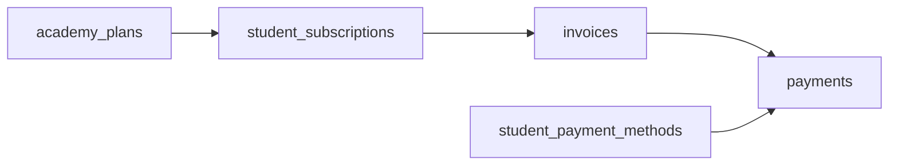

# Diagrama ER — RingPro

Modelo de dados multi-tenant. Migrations em `supabase/migrations/` (Wave 1).

**Snapshot vivo do banco remoto:** [`schema-snapshot.md`](./schema-snapshot.md) — **40 tabelas RingPro**, legado POS removido (verificado 02/09/2026).

**Identidade:** `auth.users` (Supabase Auth) — perfil estendido em `profiles` (public).

---

## Diagrama principal

```mermaid
erDiagram
    SAAS_PLANS ||--o{ ACADEMIES : "subscribed_to"
    ACADEMIES ||--o{ USER_ACADEMY_ROLES : "has"
    USERS ||--o| PROFILES : "has"
    USERS ||--o{ USER_ACADEMY_ROLES : "belongs"
    ACADEMIES ||--o{ ACADEMY_FEATURE_FLAGS : "configures"
    ACADEMIES ||--o{ ACADEMY_PLANS : "offers"
    ACADEMIES ||--o{ TRAINING_CATEGORIES : "has"
    ACADEMIES ||--o{ INSTRUCTORS : "employs"
    ACADEMIES ||--o{ STUDENTS : "enrolls"
    ACADEMIES ||--o| LANDING_PAGE_CONFIG : "publishes"
    ACADEMIES ||--o{ INVOICES : "bills"
    ACADEMIES ||--o{ LEADS : "receives"

    USERS ||--o| STUDENTS : "profile"
    USERS ||--o| INSTRUCTORS : "profile"

    STUDENTS ||--o{ STUDENT_SUBSCRIPTIONS : "has"
    ACADEMY_PLANS ||--o{ STUDENT_SUBSCRIPTIONS : "defines"
    STUDENTS ||--o{ STUDENT_CATEGORIES : "trains_in"
    TRAINING_CATEGORIES ||--o{ STUDENT_CATEGORIES : "assigned"
    STUDENTS ||--o{ STUDENT_PAYMENT_METHODS : "tokenizes"
    STUDENTS ||--o{ ATTENDANCE_RECORDS : "checks_in"

    STUDENT_SUBSCRIPTIONS ||--o{ INVOICES : "generates"
    INVOICES ||--o{ PAYMENTS : "settled_by"

    SAAS_PLANS {
        uuid id PK
        string name
        decimal price_monthly
        int max_students
        jsonb features
        enum status
    }

    ACADEMIES {
        uuid id PK
        uuid saas_plan_id FK
        string name
        string slug UK
        string cnpj
        enum status
        jsonb settings
        timestamp created_at
    }

    USERS {
        uuid id PK
        note "auth.users Supabase"
        string email UK
        timestamp created_at
    }

    PROFILES {
        uuid id PK
        uuid user_id FK
        string name
        string avatar_url
        timestamp updated_at
    }

    USER_ACADEMY_ROLES {
        uuid id PK
        uuid user_id FK
        uuid academy_id FK
        enum role
        enum status
    }

    ACADEMY_FEATURE_FLAGS {
        uuid id PK
        uuid academy_id FK
        string flag_key
        boolean enabled
    }

    ACADEMY_PLANS {
        uuid id PK
        uuid academy_id FK
        string name
        decimal price
        enum period
        int max_categories
        boolean is_public
        enum status
    }

    TRAINING_CATEGORIES {
        uuid id PK
        uuid academy_id FK
        string name
        string description
        string color
        enum status
    }

    INSTRUCTORS {
        uuid id PK
        uuid user_id FK
        uuid academy_id FK
        string bio
        string photo_url
        jsonb specialties
    }

    STUDENTS {
        uuid id PK
        uuid user_id FK
        uuid academy_id FK
        string cpf
        string phone
        enum status
        date enrollment_date
    }

    STUDENT_SUBSCRIPTIONS {
        uuid id PK
        uuid student_id FK
        uuid academy_plan_id FK
        date start_date
        date next_billing_date
        enum status
    }

    STUDENT_CATEGORIES {
        uuid id PK
        uuid student_id FK
        uuid training_category_id FK
    }

    STUDENT_PAYMENT_METHODS {
        uuid id PK
        uuid student_id FK
        enum type
        string gateway_token
        string last_four
        string brand
        boolean is_default
    }

    INVOICES {
        uuid id PK
        uuid academy_id FK
        uuid student_subscription_id FK
        decimal amount
        date due_date
        enum status
        enum type
    }

    PAYMENTS {
        uuid id PK
        uuid invoice_id FK
        decimal amount
        enum method
        string gateway_transaction_id
        enum status
        timestamp paid_at
    }

    ATTENDANCE_RECORDS {
        uuid id PK
        uuid student_id FK
        uuid academy_id FK
        uuid training_category_id FK
        uuid recorded_by FK
        date class_date
        enum status
    }

    LANDING_PAGE_CONFIG {
        uuid id PK
        uuid academy_id FK
        boolean published
        jsonb sections
        string meta_title
        string meta_description
    }

    LEADS {
        uuid id PK
        uuid academy_id FK
        string name
        string email
        string phone
        string interest_category
        string message
        enum status
    }

    AUDIT_LOGS {
        uuid id PK
        uuid user_id FK
        uuid academy_id FK
        string action
        string entity_type
        uuid entity_id
        jsonb metadata
        timestamp created_at
    }
```

---

## Domínios e responsabilidades

| Domínio | Tabelas | Quem escreve | Quem lê |
|---|---|---|---|
| Plataforma | saas_plans, platform_settings | PLATFORM_OWNER | PLATFORM_OWNER |
| Tenant | academies, academy_feature_flags | PLATFORM_OWNER | Todos (scoped) |
| RBAC | users, user_academy_roles | OWNER, PLATFORM | Guards |
| Catálogo | academy_plans, training_categories | SCHOOL_OWNER | Todos academia |
| Alunos | students, student_subscriptions, student_categories | OWNER, PROFESSOR, ASSISTANT | OWNER, PROFESSOR, ASSISTANT, STUDENT (próprio) |
| Financeiro | invoices, payments, student_payment_methods | Sistema (cron), STUDENT (cartão) | OWNER, PROFESSOR, STUDENT (próprio) |
| Presença | attendance_records | PROFESSOR, ASSISTANT | OWNER, PROFESSOR, ASSISTANT |
| Landing | landing_page_config, leads | SCHOOL_OWNER | Público (landing) |
| Auditoria | audit_logs | Sistema | PLATFORM_OWNER, SCHOOL_OWNER |

---

## Índices críticos

```sql
-- Multi-tenant: todo filtro por academy
CREATE INDEX idx_students_academy ON students(academy_id);
CREATE INDEX idx_invoices_academy_status ON invoices(academy_id, status);
CREATE INDEX idx_user_roles_user_academy ON user_academy_roles(user_id, academy_id);

-- Slug único landing
CREATE UNIQUE INDEX idx_academies_slug ON academies(slug);

-- Cobrança cron
CREATE INDEX idx_invoices_due_status ON invoices(due_date, status);
CREATE INDEX idx_subscriptions_next_billing ON student_subscriptions(next_billing_date, status);
```

---

## Enums

```sql
-- Academy
CREATE TYPE academy_status AS ENUM ('ATIVO', 'INATIVO', 'SUSPENSO');

-- Roles
CREATE TYPE user_role AS ENUM (
  'PLATFORM_OWNER', 'SCHOOL_OWNER', 'PROFESSOR', 'ASSISTANT', 'STUDENT'
);

-- Student
CREATE TYPE student_status AS ENUM ('ATIVO', 'INATIVO', 'INADIMPLENTE', 'TRIAL');

-- Financial
CREATE TYPE invoice_status AS ENUM ('PENDENTE', 'PAGO', 'ATRASADO', 'CANCELADO');
CREATE TYPE payment_method AS ENUM ('CARTAO', 'PIX', 'BOLETO');
CREATE TYPE plan_period AS ENUM ('MENSAL', 'TRIMESTRAL', 'SEMESTRAL', 'ANUAL');

-- Attendance
CREATE TYPE attendance_status AS ENUM ('PRESENTE', 'AUSENTE', 'JUSTIFICADO');
```

---

## Fluxo de dados — mensalidade


