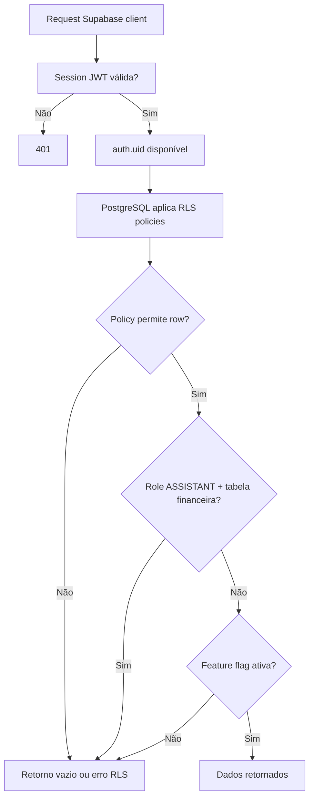

# Modelo Racional e Permissões — RingPro

Matriz RBAC por módulo. **RLS (Supabase PostgreSQL)** é a barreira real; frontend só oculta UI.

**Legenda:** ✅ criar/editar · 👁️ somente leitura · ❌ sem acesso · ⚠️ condicional

---

## 1. Papéis do sistema

| Papel | Escopo | Descrição |
|---|---|---|
| PLATFORM_OWNER | Global | Dono do SaaS RingPro |
| PLATFORM_SUPPORT | Global | Equipe suporte — KPIs e operação (`is_platform_operator`) |
| PLATFORM_FINANCE | Global | Equipe financeira SaaS — faturas academias |
| SCHOOL_OWNER | Academia | Dono/proprietário da escola |
| PROFESSOR | Academia | Instrutor com escopo por modalidade — **sem financeiro** |
| ASSISTANT | Academia | Sub-professor sem financeiro |
| STUDENT | Academia | Aluno matriculado |

Um usuário pode ter papéis diferentes em academias diferentes via `user_academy_roles`.

---

## 2. Matriz — Portal Plataforma

| Módulo / Ação | PLATFORM_OWNER | PLATFORM_SUPPORT | PLATFORM_FINANCE |
|---|---|---|---|
| Dashboard KPIs globais | ✅ | ✅ | ✅ |
| CRUD academias | ✅ | 👁️ | 👁️ |
| Suspender/reativar academia | ✅ | ❌ | ❌ |
| Financeiro SaaS (faturas academias) | ✅ | 👁️ | ✅ |
| Planos SaaS | ✅ | 👁️ | 👁️ |
| Feature flags (qualquer academia) | ✅ | ❌ | ❌ |
| Equipe plataforma (convites) | ✅ | 👁️ | 👁️ |
| Auditoria global | ✅ | 👁️ | 👁️ |
| Config gateway/e-mail | ✅ | ❌ | ❌ |

Convites: tabela `platform_staff_invites`; roles `PLATFORM_SUPPORT` e `PLATFORM_FINANCE` com `academy_id IS NULL` em `user_academy_roles`. RPC `platform_network_stats` exige `is_platform_operator()` (owner ou staff).

---

## 3. Matriz — Portal Academia

| Módulo / Ação | SCHOOL_OWNER | PROFESSOR | ASSISTANT |
|---|---|---|---|
| **Dashboard** | | | |
| KPIs alunos ativos | ✅ | ✅ | ✅ |
| KPIs receita / inadimplência | ✅ | 👁️ contagem inadimplentes* | ❌ |
| **Alunos** | | | |
| Listar alunos | ✅ | ✅ (escopo modalidade) | ✅ |
| Cadastrar aluno | ✅ | ✅ (escopo) | ✅ |
| Gerar link matrícula (`/convite/{token}`) | ✅ | ✅ | ✅ |
| Gerenciar convites pendentes | ✅ | ❌ | ❌ |
| Editar aluno | ✅ | ✅ (escopo) | ✅ |
| Ver status financeiro aluno | ✅ | 👁️ badge status | ❌ |
| Desativar aluno | ✅ | ✅ (escopo) | ❌ |
| **Professores** | | | |
| Listar professores | ✅ | ❌ | ❌ |
| Convidar professor | ✅ | ❌ | ❌ |
| Convidar sub-professor | ✅ | ❌ | ❌ |
| Remover professor | ✅ | ❌ | ❌ |
| **Categorias** | | | |
| CRUD categorias | ✅ | 👁️ (vinculadas) | 👁️ |
| **Planos** | | | |
| CRUD planos mensalidade | ✅ | 👁️ | 👁️ |
| **Financeiro** | | | |
| Ver mensalidades | ✅ | ❌ | ❌ |
| Registrar pagamento manual (dinheiro) | ✅ | ❌ | ❌ |
| Estornar | ✅ | ❌ | ❌ |
| Export relatório | ✅ | ❌ | ❌ |
| **Presença** | | | |
| Registrar chamada | ✅ | ✅ | ✅ |
| Ver histórico presença | ✅ | ✅ | ✅ |
| **Configurações** | | | |
| Dados academia (logo, endereço) | ✅ | ❌ | ❌ |
| Upload logo / fotos landing | ✅ | ❌ | ❌ |
| Feature flags (própria academia) | ✅ | ❌ | ❌ |
| Landing page editor | ✅ | ❌ | ❌ |
| Leads da landing | ✅ | ❌ | ❌ |
| **Agenda / plano de aula** | | | |
| Ver e gerenciar aulas (escopo) | ✅ | ✅ | ✅ |
| **Notificações** | ✅ | ✅ | ✅ |

\*Professor: contagem de inadimplentes para priorizar turma — sem valores, faturas ou receita.

**Checklist de validação:** [`auditoria-portal-professor.md`](./auditoria-portal-professor.md).

---

## 4. Matriz — Portal Aluno

| Módulo / Ação | STUDENT |
|---|---|
| Dashboard (plano, vencimento) | ✅ |
| Escolher/trocar plano | ✅ |
| Escolher categorias | ✅ |
| Cadastrar cartão (token) | ✅ |
| Pagar PIX/boleto | ✅ |
| Histórico pagamentos | ✅ (próprio) |
| Editar perfil | ✅ (próprio) |
| Ver professores | 👁️ |
| Ver horários | 👁️ |

---

## 5. Matriz — Landing (público)

| Ação | Visitante | STUDENT | Staff |
|---|---|---|---|
| Ver landing publicada | ✅ | ✅ | ✅ |
| Enviar formulário interesse | ✅ | ✅ | ✅ |
| Editar landing | ❌ | ❌ | ✅ (OWNER) |

---

## 6. Regras invioláveis (backend)

### 6.1 Isolamento tenant (RLS Supabase)

```text
Toda tabela de negócio: RLS habilitado + policy filtrando academy_id
auth.uid() → user_academy_roles → academy_id permitido
PLATFORM_OWNER: policy especial bypass (role check em user_academy_roles)
Service role: apenas Edge Functions (webhooks, cron) — nunca no browser
```

### 6.2 ASSISTANT — bloqueio financeiro

Rotas bloqueadas (403):

- `GET/POST /academy/financeiro/*`
- `GET /academy/alunos/:id/financeiro`
- `GET /academy/dashboard/financial-kpis`
- `POST /academy/payments/*`
- `POST /academy/invoices/*/refund`

### 6.3 STUDENT — escopo próprio

- Só acessa registros onde `student.user_id = ctx.userId`
- Não lista outros alunos

### 6.4 PCI

- Rotas de cartão: apenas STUDENT no portal aluno
- PROFESSOR/ASSISTANT: 403 em qualquer rota payment-method

### 6.5 Feature flags

- Se `module_attendance = false` → rotas `/attendance/*` retornam 404
- Se `module_landing = false` → landing retorna 404
- Se `module_payments_card = false` → UI cartão oculta + API 403

---

## 7. Compromissos por entidade

| Entidade | Campos críticos | Regras |
|---|---|---|
| academies | slug, status, saas_plan_id | slug único; SUSPENSO bloqueia login staff |
| students | status, academy_id | INADIMPLENTE via cron, não manual (exceto override owner) |
| student_subscriptions | next_billing_date | atualizado após pagamento confirmado |
| invoices | due_date, status | ATRASADO após due_date + grace period |
| student_payment_methods | gateway_token | nunca expor token completo na API |
| audit_logs | — | append-only; sem UPDATE/DELETE |

---

## 8. Fluxo de autorização


