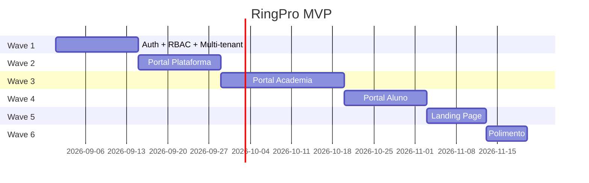
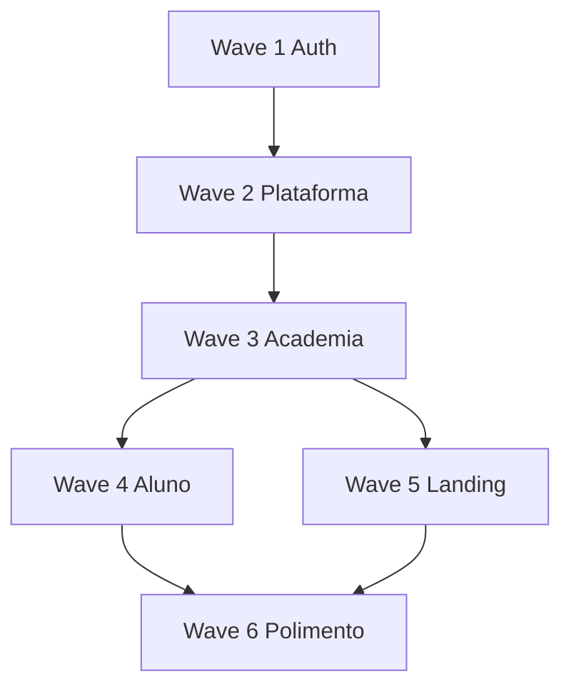

# Roadmap de Desenvolvimento — RingPro

Guia prático: **por onde começar, por onde terminar**.

---

## Visão geral das Waves

---

## Wave 1 — Auth + Fundação (COMEÇAR AQUI)

**Objetivo:** login funcional via Supabase Auth, RBAC, RLS multi-tenant, redirect por role.

### Entregáveis

- [ ] Projeto Supabase (`supabase init`) + migrations: `profiles`, `academies`, `user_academy_roles`, `audit_logs`
- [ ] Supabase Auth: login, logout, refresh, reset senha, troca senha, verificação e-mail
- [ ] RLS policies: isolamento por `academy_id` + policies por role
- [ ] Frontend: `@supabase/supabase-js` + telas auth (`mockups/auth/*`)
- [ ] Seed: 1 PLATFORM_OWNER, 1 academia teste, 1 SCHOOL_OWNER

### Tickets sugeridos

| # | Ticket | Tipo |
|---|---|---|
| 1 | Setup projeto (Vite + Supabase CLI) | Infra |
| 2 | Migrations auth/RBAC + RLS policies | Supabase |
| 3 | Supabase Auth login/logout/refresh | Supabase |
| 4 | Reset senha + verificação e-mail | Supabase |
| 5 | Hook `useAcademyContext` + checagem role no client | Frontend |
| 6 | Tela login + redirect por role | Frontend |
| 7 | Tela esqueci senha + trocar senha | Frontend |
| 8 | Testes e2e auth | Test |

### Critério de done Wave 1

- Login com cada role redireciona corretamente (Supabase Auth)
- Token refresh funciona (session Supabase)
- Query sem policy RLS retorna vazio/403 (exceto PLATFORM_OWNER)
- Audit log registra login/logout

---

## Wave 2 — Portal Plataforma

**Objetivo:** dono SaaS gerencia academias, planos SaaS, financeiro global, feature flags.

### Entregáveis

- [ ] CRUD academias + slug único
- [ ] CRUD planos SaaS
- [ ] Feature flags por academia
- [ ] Dashboard KPIs globais
- [ ] Financeiro plataforma (faturas academias)
- [ ] Mockups `platform/*`

### Tickets sugeridos

| # | Ticket | Tipo |
|---|---|---|
| 9 | Schema academies, saas_plans, feature_flags | Backend |
| 10 | CRUD academies API | Backend |
| 11 | CRUD feature flags API | Backend |
| 12 | Dashboard KPIs platform | Backend |
| 13 | Shell platform + sidebar | Frontend |
| 14 | Tela academias + nova academia | Frontend |
| 15 | Tela feature flags | Frontend |

### Critério de done Wave 2

- PLATFORM_OWNER cria academia → SCHOOL_OWNER recebe credenciais
- Feature flag desativada reflete no banco
- Dashboard mostra contagem academias/alunos

---

## Wave 3 — Portal Academia

**Objetivo:** owner/professor/assistant gerenciam alunos, categorias, planos, financeiro (exceto assistant).

### Ordem interna

1. **SCHOOL_OWNER** (todas as telas)
2. **PROFESSOR** (reutiliza com RBAC)
3. **ASSISTANT** (remove financeiro)

### Entregáveis

- [ ] CRUD alunos, professores, categorias, planos
- [ ] Financeiro academia + inadimplência
- [ ] Presença (se flag ativa)
- [ ] Job cron dunning
- [ ] Mockups `academy/*`

### Critério de done Wave 3

- Professor cadastra aluno → aluno recebe e-mail
- Lista alunos filtra inadimplentes
- ASSISTANT recebe 403 em /financeiro
- Cron marca INADIMPLENTE após grace period

---

## Wave 4 — Portal Aluno

**Objetivo:** aluno escolhe plano, categorias, paga mensalidade.

### Entregáveis

- [x] Integração Pagar.me (tokenização) — UP-203, ADR-001
- [x] PIX/boleto + webhooks — UP-204, UP-209
- [x] Portal aluno completo — pagamento, onboarding, QR PIX
- [x] Cobrança recorrente cartão — UP-205
- [ ] Mockups `student/*` — UP-501

### Critério de done Wave 4

- Aluno cadastra cartão → cobrança automática funciona
- PIX gera QR → webhook confirma → ATIVO
- Histórico pagamentos exibe corretamente

---

## Wave 5 — Landing Page

**Objetivo:** site público por academia com formulário de lead.

### Entregáveis

- [ ] Rota pública `/a/{slug}`
- [ ] Editor seções (owner)
- [ ] Formulário lead → notificação
- [ ] Mockups `landing/*`

### Critério de done Wave 5

- Landing publicada acessível publicamente
- Lead notifica owner
- Despublicar retorna 404

---

## Wave 6 — Polimento (TERMINAR AQUI)

- Notificações in-app
- Relatórios export CSV/PDF
- 2FA PLATFORM_OWNER
- Hardening NFR (rate limit, logs)
- Testes e2e fluxo completo

---

## Feature flags — quando implementar

| Flag | Wave |
|---|---|
| Todas as flags (CRUD) | Wave 2 |
| `module_attendance` | Wave 3 |
| `module_payments_*` | Wave 4 |
| `module_landing` | Wave 5 |
| Demais flags | Wave 2 (CRUD) + Wave específica (UI) |

---

## Dependências entre Waves

**Não pular waves.** Cada wave depende da anterior.

---

## Ideias registradas (V2+)

Estas funcionalidades estão documentadas no PRD mas **não entram no MVP**:

| Feature | Descrição |
|---|---|
| App nas lojas (iOS/Android) | Publicação App Store / Google Play; backend Supabase reutilizado; ver PRD §5.3 |
| Capacitor ou React Native | Empacotar portal aluno — decisão técnica na V2 |
| Push notifications | Cobrança, vencimento, status do aluno |
| QR check-in | Presença por QR code — UP-301 ✅ |
| Multi-unidade | Filiais por academia |
| Graduação/faixas | Controle de faixas |
| WhatsApp | Lembretes via API |
| Self-register aluno | Cadastro público |
| Pro-rata | Troca de plano proporcional |
| Subdomínio | `{slug}.ringpro.app` |
| Campeonatos | Inscrições e chaves |
| E-commerce | Loja de equipamentos |

---

## V2 — Multi-canal (web + app nas lojas)

**Objetivo:** manter a web em produção e publicar app do **portal aluno** nas lojas.

| Entrega | Notas |
|---|---|
| Web responsiva | Já entregue no MVP — canal contínuo |
| PWA portal aluno | Should no MVP; melhorar ícone/offline na V2 |
| App iOS + Android | Capacitor (reuso React) ou React Native — decidir na V2 |
| Push + deep links | Edge Functions + serviço push |
| Guidelines lojas | Validar política de pagamento (Pagar.me vs in-app purchase) |

**Princípio:** nenhuma regra de negócio exclusiva do browser — RLS e Edge Functions são a fonte da verdade.

Referência: [PRD §5.3](./PRD.md#53-estratégia-multi-canal--web-e-apps-nas-lojas).
