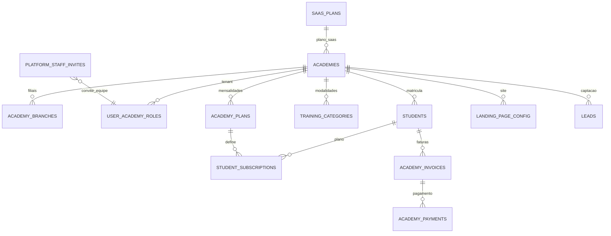

# Schema snapshot — RingPro (Supabase `public`)


> **Fonte:** verificação remota em **02/09/2026** via `scripts/sql/verify-ringpro-schema.sql` (`npx supabase db query --linked`).  

> **Projeto:** `iqqmcvrwysoqoondbnbh` (artedadefesa) · região `sa-east-1`.


---


## Resumo executivo


| Grupo | Quantidade | Status |

|-------|------------|--------|

| **Tabelas RingPro** | **44** | ✅ Alinhado (Ondas A+B + UP-301…306) |

| **Views legado** | 0 | ✅ `v_estoque_global` removida |

| **Tabelas POS legado** | 0 | ✅ Removidas 02/09/2026 |

| **RPCs Fase 4** | 5 | ✅ `platform_network_stats`, `get_public_academy_flags`, `get_public_platform_staff_invite`, `is_platform_staff`, `is_platform_operator` |

| **Enum `user_role`** | +2 valores | ✅ `PLATFORM_SUPPORT`, `PLATFORM_FINANCE` |

| **Migrations registradas** | `146000`–`318400` | ✅ |


---


## Catálogo de tabelas (`public`)


| # | Tabela | Domínio |

|---|--------|---------|

| 1 | `academies` | Plataforma / tenant |

| 2 | `academy_branches` | Filiais (UP-405) |

| 3 | `academy_feature_flags` | Feature flags |

| 4 | `academy_invoices` | Financeiro aluno |

| 5 | `academy_payments` | Financeiro aluno |

| 6 | `academy_plan_categories` | Planos locais |

| 7 | `academy_plan_price_history` | Planos locais |

| 8 | `academy_plans` | Planos locais |

| 9 | `academy_terms` | Termo matrícula |

| 10 | `attendance_records` | Presença |

| 11 | `audit_logs` | Auditoria |

| 12 | `class_sessions` | Agenda |

| 13 | `instructor_training_categories` | Equipe / modalidade |

| 14 | `instructors` | Equipe |

| 15 | `landing_page_config` | Landing |

| 16 | `leads` | Landing / CRM |

| 17 | `notifications` | In-app |

| 18 | `platform_staff_invites` | Equipe plataforma (UP-404) |

| 19 | `platform_settings` | Config global SaaS (Onda B) |

| 20 | `profiles` | Auth |

| 21 | `saas_invoices` | Financeiro SaaS |

| 22 | `saas_payments` | Pagamentos fatura SaaS (Onda B) |

| 23 | `saas_plans` | Planos SaaS |

| 24 | `schedule_series` | Agenda |

| 25 | `staff_invites` | Convite equipe academia |

| 26 | `student_body_metrics` | Aluno / físico |

| 27 | `student_categories` | Aluno / modalidades (turmas) |

| 28 | `student_invites` | Convite aluno |

| 29 | `student_payment_methods` | Pagamento tokenizado |

| 30 | `student_subscriptions` | Assinatura aluno |

| 31 | `student_term_acceptances` | Termo |

| 32 | `students` | Aluno (`branch_id` opcional — Onda B) |

| 33 | `training_categories` | Modalidades / turmas |

| 34 | `user_academy_roles` | RBAC |


> Contagem **34** após Ondas A+B (`platform_settings`, `saas_payments`, enums, gateway).


---


## 1. Plataforma SaaS (dono RingPro)


| Tabela | Propósito |

|--------|-----------|

| `saas_plans` | Planos do SaaS (preço mensal, limites) |

| `saas_invoices` | Faturas que academias pagam ao RingPro |

| `academies` | Tenant — academia (`settings` jsonb, `saas_plan_id`) |

| `academy_feature_flags` | Flags por academia (`module_*`) |

| `platform_staff_invites` | Convites equipe plataforma (UP-404) |
| `platform_settings` | Config global gateway/e-mail/billing (Onda B) |
| `saas_payments` | Tentativas de pagamento fatura SaaS (Onda B) |
| `audit_logs` | Auditoria global |


### `academies`


| Coluna | Tipo | Null | Default |

|--------|------|------|---------|

| id | uuid | NO | gen_random_uuid() |

| name | text | NO | — |

| slug | text | NO | — |

| status | academy_status | NO | ATIVO |

| settings | jsonb | NO | {} |

| saas_plan_id | uuid | YES | — |

| cnpj | text | YES | — |

| billing_email | text | YES | — |

| created_at / updated_at | timestamptz | NO | now() |


---


## 2. Auth / RBAC


| Tabela | Propósito |

|--------|-----------|

| `profiles` | Perfil estendido (`auth.users`) |

| `user_academy_roles` | RBAC multi-tenant (`academy_id` NULL = plataforma) |


### `user_academy_roles`


| Coluna | Tipo | Notas |

|--------|------|-------|

| user_id | uuid | → auth.users |

| academy_id | uuid | NULL para PLATFORM_OWNER / SUPPORT / FINANCE |

| role | user_role | enum — inclui `PLATFORM_SUPPORT`, `PLATFORM_FINANCE` |

| status | role_status | ATIVO / INATIVO |


---


## 3. Academia — catálogo e equipe


| Tabela | Propósito |

|--------|-----------|

| `training_categories` | Modalidades (boxe, muay thai…) |

| `academy_plans` | Planos de mensalidade da academia |

| `academy_plan_categories` | N:N plano ↔ modalidade |

| `academy_plan_price_history` | Histórico de preço |

| `academy_terms` | Termo de matrícula (HTML) |

| `academy_branches` | Filiais (UP-405) |

| `instructors` | Professor vinculado à academia |

| `instructor_training_categories` | Professor ↔ modalidade |

| `staff_invites` | Convite professor/assistant |


---


## 4. Alunos e matrícula


| Tabela | Propósito |

|--------|-----------|

| `students` | Aluno na academia |

| `student_categories` | Aluno ↔ modalidades |

| `student_subscriptions` | Plano ativo do aluno |

| `student_invites` | Convite por link |

| `student_payment_methods` | Cartão tokenizado (gateway) |

| `student_term_acceptances` | Aceite do termo |

| `student_body_metrics` | Peso/altura histórico |

| `leads` | Lead da landing |


### `students` (colunas principais)


| Coluna | Tipo | Notas |

|--------|------|-------|

| user_id, academy_id | uuid | tenant |

| status | student_status | ATIVO, INADIMPLENTE, TRIAL, INATIVO |

| trial_ends_at | timestamptz | período experimental |

| onboarding_completed_at | timestamptz | wizard aluno |

| inactive_reason / inactive_at | text / timestamptz | inativação staff |

| fights_count, sparring_sessions | int4 | stats treino |


---


## 5. Financeiro academia (mensalidades aluno)


| Tabela | Propósito |

|--------|-----------|

| `academy_invoices` | Fatura do aluno para a academia |

| `academy_payments` | Pagamento da fatura (PIX, cartão…) |


> **Não confundir** com `saas_invoices` (academia → RingPro).


---


## 6. Presença


| Tabela | Propósito |

|--------|-----------|

| `attendance_records` | Chamada por turma/data |


---


## 7. Agenda / aulas


| Tabela | Propósito |

|--------|-----------|

| `schedule_series` | Série recorrente |

| `class_sessions` | Sessão (aula, evento, particular) |


---


## 8. Landing e marketing


| Tabela | Propósito |

|--------|-----------|

| `landing_page_config` | Seções JSON + `published` |

| `leads` | Formulário de interesse |


---


## 9. Notificações


| Tabela | Propósito |

|--------|-----------|

| `notifications` | In-app por `user_id` |


---


## 10. Legado POS — removido (histórico)


Sistema anterior (varejo/caixa). **Removido em 02/09/2026** via migration `20260831500000_drop_pos_legacy_tables.sql`.


Objetos que **não existem mais**: `clientes`, `empresas`, `lojas`, `produtos`, `vendas`, `itens_venda`, `pagamentos_venda`, `sessoes_caixa`, `movimentacoes_caixa`, `estoque_localizacao`, `historico_estoque`, `v_estoque_global`, `vendas_numero_venda_seq`.


---


## 11. Dívida técnica (pós Onda A)

**Resolvido** em [`PLANO-SCHEMA-HARDENING.md`](./PLANO-SCHEMA-HARDENING.md) — migrations `161000`–`164000`:

- Enums: `invite_status`, `lead_status`, `subscription_status`, `payment_record_status`, `session_status`
- `staff_invites.role` → `user_role`; planos → `academy_status`
- Gateway: `gateway_*` em `academy_invoices`, `academy_payments`, `saas_invoices`
- RLS equipe plataforma; `COMMENT ON TABLE` principais

**Onda B (aplicada):**

| Objeto | Entregável |
|--------|------------|
| `platform_settings` | config global SaaS (gateway, email, billing) |
| `academies.cnpj`, `billing_email` | dados fiscais/cobrança |
| `saas_payments` | histórico cobrança plataforma |
| `students.branch_id` | filial operacional do aluno |
| `student_documents` | UP-311 — documentos do aluno (atestado, saúde) |
| `class_makeup_credits`, `class_makeup_redemptions` | UP-312 — reposição de aula |
| `class_groups`, `class_group_members` | UP-313 — turma operacional com roster |
| `attendance_qr_sessions` | UP-301 — check-in por QR |
| `belt_levels`, `student_belt_history` | UP-302 — graduação / faixas |
| `body_assessment_cycles` | UP-305 — lembretes avaliação física |
| `academy_contract_documents` | UP-306 — contrato PDF matrícula |

**Backlog opcional (pós B):**

| Tabela / item | Ticket |
|---------------|--------|
| `training_categories.status` → enum | hardening futuro |
| `instructors.status` → enum | hardening futuro |


## 12. Mapa ER simplificado (RingPro)





---


## 13. Verificação contínua


```bash

# Requer supabase login + projeto linkado

npx supabase db query --linked -f scripts/sql/verify-ringpro-schema.sql

```


**Esperado:** 0 linhas `LEGADO_POS` · 4 linhas `OK_RINGPRO` · `RESUMO` = 32 · 2 `ENUM_ROLES` · 5 `RPC` · 6 `MIGRATION`.


Introspecção completa (colunas, RLS, FK): [`schema-introspection.md`](./schema-introspection.md).


