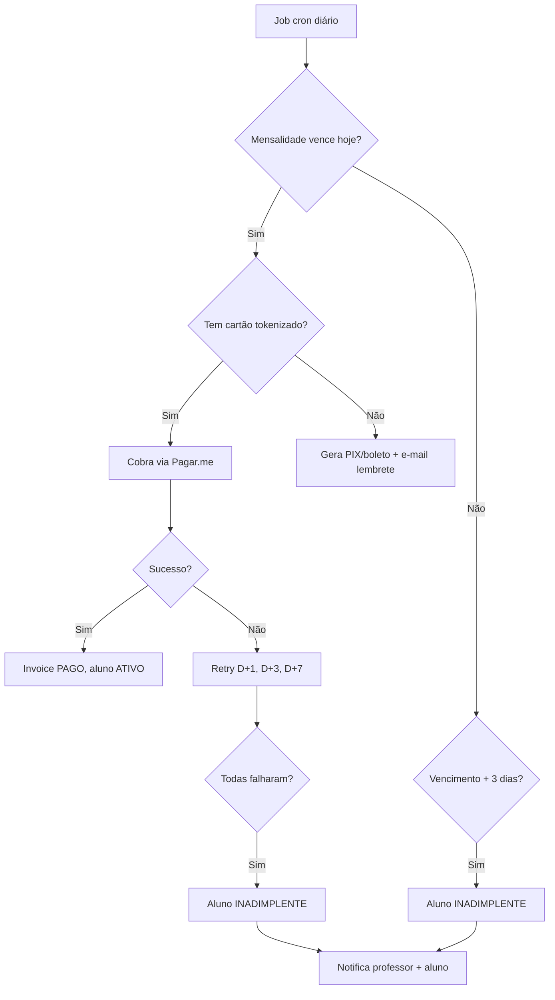
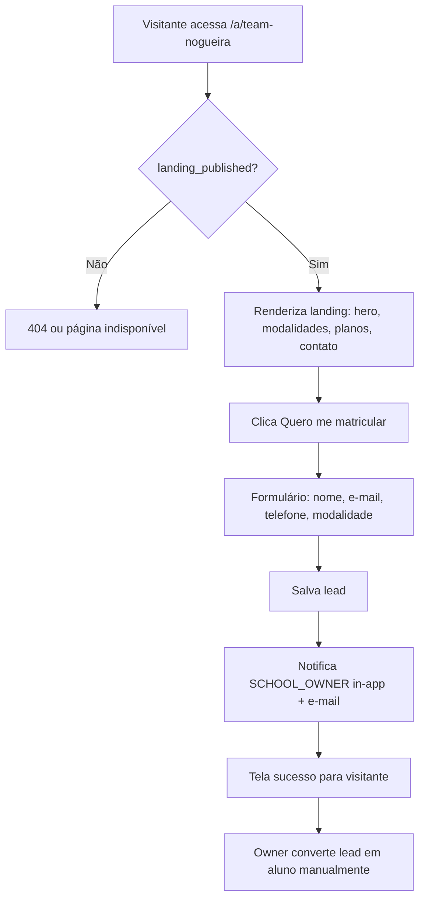

# Wireflows — RingPro

Jornadas clique a clique. Mockup correspondente quando existir.

**Ordem de implementação:** Auth → Plataforma → Academia → Aluno → Landing

---

## WF-1 — Login e redirect (Wave 1)

**Mock:** `mockups/auth/00-Login`

```mermaid
flowchart TD
  A[Acessa /login] --> B{Credenciais válidas?}
  B -->|Não| C[Toast erro]
  C --> A
  B -->|Sim| D{must_change_password?}
  D -->|Sim| E[/auth/trocar-senha]
  D -->|Não| F{e-mail verificado?}
  F -->|Não| G[Tela verificar e-mail]
  F -->|Sim| H{2FA ativo?}
  H -->|Sim| I[/auth/2fa]
  H -->|Não| J{Qual role?}
  J -->|PLATFORM_OWNER| K[/platform/dashboard]
  J -->|SCHOOL_OWNER/PROFESSOR/ASSISTANT| L[/academy/dashboard]
  J -->|STUDENT| M[/student/dashboard]
  I --> J
  E --> J
```

---

## WF-2 — Dono SaaS cadastra academia (Wave 2)

**Mock:** `mockups/platform/01-Academias`

```mermaid
flowchart TD
  A[Login PLATFORM_OWNER] --> B[/platform/academias]
  B --> C[Clica Nova Academia]
  C --> D[Form: nome, slug, plano SaaS, e-mail owner]
  D --> E{Slug disponível?}
  E -->|Não| F[Erro slug em uso]
  F --> D
  E -->|Sim| G[Salva academia ATIVO]
  G --> H[Cria user SCHOOL_OWNER com senha provisória]
  H --> I[E-mail credenciais async]
  I --> J[Tela sucesso + link academia]
  J --> K[Configura feature flags da academia]
```

---

## WF-3 — Owner configura academia (Wave 3)

**Mock:** `mockups/academy/07-Configuracoes`, `03-Categorias`, `04-Planos`

```mermaid
flowchart TD
  A[Login SCHOOL_OWNER] --> B[/academy/dashboard]
  B --> C[/academy/configuracoes]
  C --> D[Preenche dados: logo, endereço, horários]
  D --> E[/academy/categorias]
  E --> F[Cria categorias: Boxe, Muay Thai, Jiu-Jitsu...]
  F --> G[/academy/planos]
  G --> H[Cria planos: Básico R$99, Premium R$149...]
  H --> I[/academy/professores]
  I --> J[Convida professor / sub-professor]
  J --> K[Pronto para cadastrar alunos]
```

---

## WF-4 — Professor cadastra aluno (Wave 3)

**Mock:** `mockups/academy/01-Alunos`

```mermaid
flowchart TD
  A[Login PROFESSOR ou OWNER] --> B[/academy/alunos]
  B --> C[Clica Novo Aluno]
  C --> D[Form: nome, e-mail, CPF, telefone, plano]
  D --> E[Seleciona categorias permitidas pelo plano]
  E --> F[Salva aluno status TRIAL ou ATIVO]
  F --> G[Cria user STUDENT + senha provisória]
  G --> H[E-mail credenciais async]
  H --> I[Lista alunos atualizada]
```

---

## WF-5 — Aluno onboarding (Wave 4)

**Mock:** `mockups/student/00-Dashboard`, `01-Meu-Plano`, `03-Pagamento`

```mermaid
flowchart TD
  A[Recebe e-mail credenciais] --> B[/login]
  B --> C[Força troca senha]
  C --> D[/student/dashboard]
  D --> E{Plano definido?}
  E -->|Não| F[/student/meu-plano]
  F --> G[Escolhe plano]
  G --> H[/student/modalidades]
  H --> I[Seleciona categorias]
  I --> J[/student/pagamento]
  J --> K{Forma pagamento?}
  K -->|Cartão| L[Pagar.me SDK tokeniza]
  K -->|PIX| M[Gera QR code]
  K -->|Boleto| N[Gera boleto PDF]
  L --> O[Webhook confirma]
  M --> O
  N --> O
  O --> P[Status ATIVO]
  P --> Q[Dashboard com próximo vencimento]
  E -->|Sim| Q
```

---

## WF-6 — Cobrança recorrente e inadimplência (Transversal)



---

## WF-7 — Sub-professor (sem financeiro) (Wave 3)

**Mock:** `mockups/academy/00-Dashboard` (variante assistant)

```mermaid
flowchart TD
  A[Login ASSISTANT] --> B[/academy/dashboard]
  B --> C[Dashboard SEM KPIs financeiros]
  C --> D[Menu: Alunos, Presença, Categorias]
  D --> E{Tenta acessar /academy/financeiro?}
  E -->|Sim| F[403 Forbidden]
  E -->|Não| G[Operação normal: alunos, presença]
```

---

## WF-8 — Landing page e lead (Wave 5)

**Mock:** `mockups/landing/00-Template`



---

## WF-9 — Feature flag desativa módulo (Wave 2+)

```mermaid
flowchart TD
  A[PLATFORM_OWNER ou SCHOOL_OWNER] --> B[/configuracoes/feature-flags]
  B --> C[Desativa module_attendance]
  C --> D[Salva flag no banco]
  D --> E[Menu Presença some para todos roles academia]
  E --> F[API /attendance retorna 403 ou 404]
```

---

## Mapa de wireflows × waves

| Wireflow | Wave | Prioridade |
|---|---|---|
| WF-1 Login | 1 | Must |
| WF-2 Cadastro academia | 2 | Must |
| WF-3 Config academia | 3 | Must |
| WF-4 Cadastro aluno | 3 | Must |
| WF-5 Onboarding aluno | 4 | Must |
| WF-6 Cobrança/inadimplência | 3–4 | Must |
| WF-7 Sub-professor | 3 | Must |
| WF-8 Landing/lead | 5 | Must |
| WF-9 Feature flags | 2 | Must |
